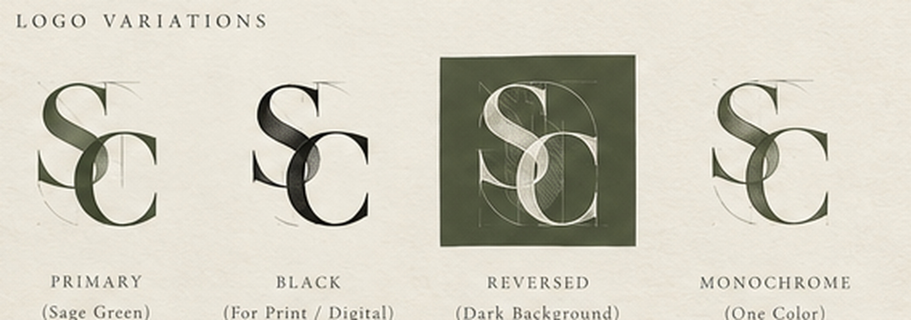
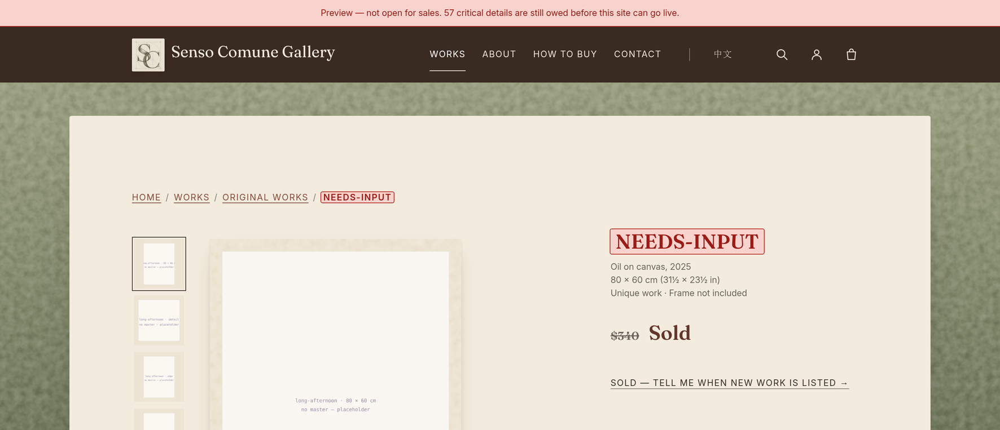
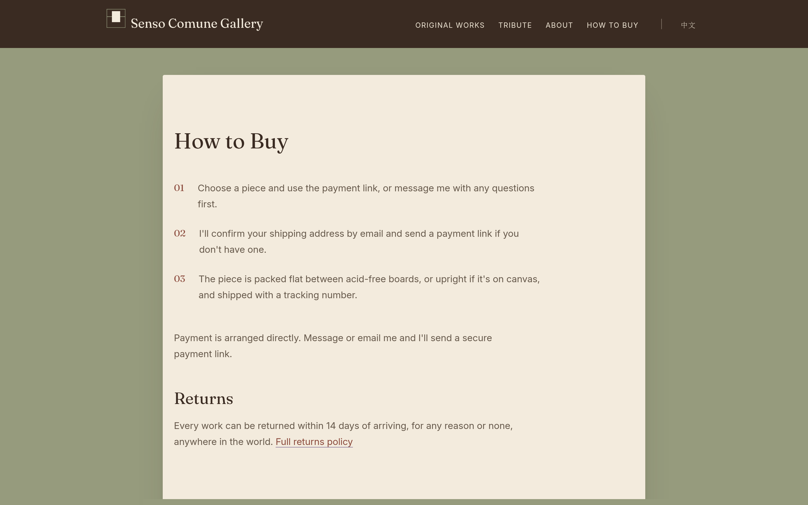

```{=latex}
\startbody
```

# Summary {#sec-summary}

## What this is

A site selling unique paintings — six in the catalogue at the time of writing,
priced \$60–\$440 — run by one non-technical person resident in mainland China,
addressed equally to international and domestic buyers.

That last sentence contains most of the difficulty. A gallery site for a
handful of works is an afternoon's work. A gallery site for a handful of works
that takes money across the Chinese border, ships physical objects
internationally, satisfies two consumer-law regimes at once and loads
acceptably on both sides of the Great Firewall is not.

Nothing in the build is fixed to six. The counts, the series and the page set
are all derived from the work data; adding a seventh work, or a new series, is
a data edit.

## Where things stand {#sec-status}

```{=latex}
\Needspace*{14\baselineskip}
```

: The site on 18 September 2026 {#tbl-status}

| | |
|:--------------------|:--------------------------------------------------------------|
| Built | 36 pages, 18 in each language: the homepage, the catalogue and its two series, six work pages, sold works, and seven pages of information |
| Published | A **preview** on GitHub Pages: not indexed, labelled on every page, and unable to take an order |
| Ready to sell | **No.** The readiness gate counts 57 details still owed (@sec-readiness-today), and a release refuses to build until they are supplied |
| Checked | Five checks on every build, and a sixth in a real browser (@sec-checks) |
| Still to build | The buy box and disclosures on the work page; the cart, search and account behind the shop bar (@sec-next-todo) |

## The seven findings that would have sunk it {#sec-blockers}

: Blocking findings, all now dealt with in the build {#tbl-blockers}

| Finding | Where |
|:----------------------------------------------------------|:-------------|
| Every call to action was `#A19E97` — **2.67:1**, failing both the body-text and the large-text floor. No font size rescues it. | @sec-palette |
| **Stripe**\index{Stripe} is unavailable to a mainland-China seller — the whole account, not merely PayPal. **Airwallex**\index{Airwallex} excludes mainland entities from card acquiring and opens no individual accounts at all. | @sec-paying |
| `vercel.app` and `workers.dev` measure **100% blocked** from mainland China. `pages.dev` measures 0%. | @sec-decisions |
| A unique pre-existing painting gets **no returns exception** under either Chinese or EU law. Uniqueness is not personalisation. | @sec-returns |
| Instagram was the only contact channel. It is blocked in mainland China, and EU law requires an email address regardless. | @sec-disclosure |
| **China-origin paintings are not duty-free into the United States.** Section 301\index{Section 301} adds 7.5% and the \$800 de minimis\index{de minimis} exemption is suspended. | @sec-duty |
| A one-page site cannot link to one painting, which is the site's main acquisition motion. | @sec-structure |

## Decisions taken {#sec-decisions}

```{=latex}
\begin{finding}{Settled}
```

**Launch as an individual**, with the Hong Kong entity\index{Hong Kong entity}
reachable as a configuration change rather than a rebuild. Under CNY 100,000
annual turnover there is no business-registration requirement, no
foreign-exchange quota consumed, no balance-of-payments filing and no VAT.

**Host on Cloudflare Pages**\index{Cloudflare Pages}. The only option with no
bill, no pause, no terms problem and no ICP filing\index{ICP filing}.

**A page for everything that is shared.** Every work, series and policy has its
own address in both languages; two lines of CSS (`@view-transition`) keep the
calm of a single page when moving between them.

**Self-host the fonts.** 81.7 KB for both families, built from the variable
originals.

**Adopt Priscilla's sage palette**, with text moved onto cream.

```{=latex}
\end{finding}
```

## Cost {#sec-cost}

: Running cost of the recommended build {#tbl-cost}

| Item                              | One-off | Annual |
|:----------------------------------|--------:|-------:|
| Hosting (Cloudflare Pages)        |      \$0 |    \$0 |
| Domain (registrar at cost)        |       —  |   \$11 |
| Fonts, licensing (SIL OFL)        |      \$0 |    \$0 |
| Analytics                         |      \$0 |    \$0 |
| Photography, phone build          |  \$6–25  |     —  |
| Photography, full build           | \$360–400|     —  |
| Copyright registration, batch     |     \$85 |     —  |
| **Total, minimum viable**         | **\$6–25** | **\$11** |

Payment processing is separate and depends on the entity decision; see
@sec-paying.

# Design {#sec-design}

## Where the design came from

Priscilla supplied a nine-page draft and, later, a live mockup with a revised
palette. Both were treated as the brief. The work here was not to redesign but
to find where the drawing and the medium disagree — and they disagreed mostly
about contrast.

## The palette {#sec-palette}

Priscilla's mockup moves the site from white to a sage-green world: a dark
brown masthead bar, warm brown text, terracotta, and cream plates behind the
paintings. Two of her decisions were already right and are kept exactly as
drawn — the warm browns, and a **filled** terracotta button.

{#fig-palette width=100% fig-pos="H"}

### What could not be adopted as drawn {#sec-sage}

Body text on the sage does not pass, and the accent on sage is worse than the
value it was replacing.

{#fig-sage width=100% fig-pos="H"}

```{=latex}
\begin{finding}{The resolution was already in her own mockup}
```

She sets the paintings on light cream plates against the sage. So sage becomes
the **field** and cream the **reading surface** — the whole content column is a
cream sheet mounted on sage, which is what a gallery does to a work on paper
anyway.

Her green stays dominant at the margins, the reading happens on cream, and
nothing sets text on sage.

```{=latex}
\end{finding}
```

### The warm-ground trap {#sec-trap}

`#767676` is the canonical "lightest grey that passes on white". On pure white
it passes at 4.54:1, with 0.04 to spare. Warm the ground at all and it fails.

This caught the project three times — twice in tokens written specifically to
avoid it. The response was to stop checking by eye: `scripts/check-contrast.mjs`
recomputes every token against **the darkest ground it is ever painted on** and
fails the build on a regression.

## Typography {#sec-type}

Two open-source variable faces, self-hosted: Fraunces\index{Fraunces} and Inter.

: Font build, measured rather than estimated {#tbl-fonts}

| Build                                                   |   Bytes |
|:--------------------------------------------------------|--------:|
| Fraunces, all four axes                                  | 121,124 |
| **Fraunces, `opsz` 14–40, `wght` 400–700, `WONK` 1**     | **51,868** |
| Fraunces, `opsz` pinned                                  |  32,500 |
| **Inter, `opsz` 18, `wght` 400–600**                     | **29,856** |
| **Total, both families, latin subset**                   | **81,724** |

Two corrections came out of running the build rather than reading about it.
The draft sets Fraunces at six optical sizes — 16.0, 16.8, 21.6, 27.2, 30.4 and
38.4 — so the `opsz` axis must stay live; pinning it saves 19 KB and flattens
the optical sizing the design depends on. And Fraunces' `WONK` axis defaults to
**1, not 0**; pinning it to 0 changes the letterforms to save 140 bytes.

### The scale {#sec-scale}

Not the golden ratio. The one proportional system in Leonardo's own hand, on
the *Vitruvian Man* sheet, is whole-number fractions of height.

: Type scale, and how close Priscilla's draft already was {#tbl-scale}

| Role             | Fraction         | Computed | Draft used |
|:-----------------|:-----------------|---------:|-----------:|
| Hero             | 1 (the height)   |  38.4 px |    38.4 px |
| Section heading  | less 1/8         |  33.6 px |    30.4 px |
| Sub-heading      | less 1/4         |  28.8 px |    27.2 px |
| Wordmark         | 1/6 + 1/4        |  22.4 px |    21.6 px |
| Body             | the unit         |  16.8 px |    16.8 px |
| Caption          | less 1/4         |  12.6 px |    13.1 px |

## The mark {#sec-mark}

The site had a wordmark and no mark. On a business whose entire acquisition
motion is a link in an Instagram or a WeChat bio, the surfaces that render
most often are a browser tab, a share card and an avatar — and none of them
can render a wordmark.

The mark it now carries is Priscilla's own: an interlocking **SC** monogram,
drawn, with a prototype sheet that arrives with a construction, a palette, four
variations and a minimum size already worked out. **The site uses that
artwork itself** — her drawing, cropped and resized, never redrawn.

### The constraint that used to decide it {#sec-mark-constraint}

The wordmark translates: *Senso Comune Gallery* in English, 常识画廊\index{wordmark} in
Chinese. A favicon, by contrast, is chosen by **origin**, not by page: one file
serves both URL trees, so a site cannot ship one mark per locale however much
it would like to.

The first mark took that to its conclusion and carried no letterforms at all —
a work on a wall, three rectangles and a hanging line — on the argument that
`SC` is not the initials of 常识画廊 and would therefore serve one audience
and decorate the other.

```{=latex}
\begin{finding}{Why that argument no longer holds}
```

Finding C-04 asked for the Latin wordmark to be kept constant in both locales,
and was **closed by decision**: Priscilla keeps 常识画廊 as the Chinese name,
because it reads as native to the domestic audience and that is worth more
than one lockup in two languages.

That decision is what frees the mark. A monogram is not a translation of a
name — it is a *device* that stands beside one, and a device does not have to
be readable as the name it accompanies any more than a crest does. The Latin
device beside the Chinese name is the arrangement most international houses
use in China. What is not allowed is a mark that says a *different* name in
each locale, and the build asserts that the lockup is byte-identical on the
English and Chinese homepages.

```{=latex}
\end{finding}
```

### The sheet, as drawn {#sec-mark-sheet}

{#fig-brand width=100% fig-pos="H"}

Construction and proportion, the hatching detail, the four variations, clear
space and minimum size, the four brand colours, and the horizontal and vertical
lockups.

{#fig-mark width=92% fig-pos="H"}

This is the artwork the site uses: the monogram with its construction lines,
over the wordmark. Everything the build ships is a crop and a resize of this
one file.

Both files live in `brand/`, unmodified, and are pinned by hash: re-exporting
or tidying either one fails the build and has to be a decision rather than an
accident. They arrived at `dist/archive/logo/`, which is build output and is
gitignored, so keeping them meant moving them somewhere the repository keeps.

### The notes on the sheet, and what each one costs {#sec-mark-notes}

Every row's left column is the sheet's own wording. The right column is what
it means once the mark has to live in a browser tab, on a phone masthead and
in this document.

```{=latex}
\Needspace*{16\baselineskip}
```

: The sheet's specification, and the issue against each {#tbl-mark}

| As the sheet states it | What it costs, and what was done |
|:-----------------------------------|:-----------------------------------------------|
| **Golden Ratio 1 : 1.618** | Adopted as drawn — the artwork *is* the construction, so nothing has to be re-derived. The number only became a question when the mark was being rebuilt rather than used; see @sec-mark-construction |
| **Letter Proportion S : C = 1 : 1.618** | As above. Taken literally in a *rebuild* it makes the S fall to about the C's x-height; in Priscilla's own drawing the S is visibly larger than 1/1.618 of the C, which is why the drawing reads and a literal reconstruction did not |
| **Grid System based on Fibonacci Spiral & Golden Rectangle** | Visible in the artwork as construction lines, and they are part of the drawing, not scaffolding to be cleaned off. They are also the first thing to disappear as the file gets smaller — by 32 px they are grey haze (@fig-mark-sizes) |
| **Diagonal Hatching, Upper Left → Lower Right** | The same direction and angle as the Leonardo hatch already running across the Tribute ground (`base.css`, `.hatch`) — an agreement nobody arranged, and worth keeping |
| **Subtle texture / Enhances depth and form / Not overpowering** | True at the sizes the sheet is drawn for. At 32 px the hatching has become tone rather than texture, and at 16 px it is a smudge. Nothing in the build can fix that; it is stated instead (@sec-mark-issues) |
| **Primary (Sage Green)** `#969B7D` | Already `--field`, exactly |
| **Black (For Print / Digital)** `#24241F` | **Not adopted as a site colour.** The site's ink and bar are `#3A2B22`, a warm brown the whole palette is solved against; a cool near-black beside sage reads as a second, colder identity. It is kept for print, where it is what the sheet says |
| **Reversed (Dark Background)** | The variation that would suit the masthead best — and it is a *different drawing* from the preferred one: solid letters, no construction lines. Not used, because the instruction was to use the preferred option. The site instead lets the artwork's own cream paper be the plate, which is the site's own device |
| **Monochrome (One Color)** | Held in reserve for single-ink reproduction, where the hatching and the letter cannot be separated by lightness at all |
| **Deep Green** `#737C61` | Already `--field-deep`, exactly |
| **Warm Ivory** `#E9E2D3` | **Not added.** Within one step of `--wash-blue` `#E9E3D6`; a fifth cream is a fifth cream. The artwork's own paper measures `#E4DCCC` and is kept as it is |
| **Clear Space & Minimum Size — 15 mm (Print)** | The icon build uses the sheet's clear-space rule as its crop, at 5.5 % of the monogram's side. The minimum size is the sheet's for print; the screen equivalents are in @sec-mark-issues, and they are smaller than 15 mm |
| **Horizontal lockup / Vertical lockup** | Both are on the sheet and neither is used yet. The site's masthead is its own lockup — the mark beside a wordmark already set in Fraunces — and the two supplied lockups set the name in a different face |
| **"Art connects what we share"** | A line, not a tagline in use. It is not on the site, and nothing here proposes putting it there |
| **"Timeless / Art Gallery / Identity"** | The sheet's own note on intent. Recorded, and it is the right description |

### The issues, one by one {#sec-mark-issues}

Four of these are worth more than a table row. None is a reason not to use the
artwork; all four are reasons to know what using it costs.

**1 — There is no vector, and the raster is 1536 × 1024.** That is the whole
supply. The monogram occupies about 590 px of it, which is enough for a 180 px
home-screen icon and a masthead mark at 2× on a phone, and is the ceiling. A
business card, a 15 mm foil stamp or a gallery window would each want the
original vector or a much larger scan. **Ask for the source file** — it exists
somewhere, and it costs nothing to keep with the rest.

**2 — A drawn mark does not survive 16 px.** @fig-mark-sizes shows the same
crop of the same file at each size that ships. At 180 px it is the drawing; at
32 px the construction lines have gone to haze and the hatching to tone; at
16 px what is left is a shape that reads as *a monogram* rather than as an S
and a C. That is the size a browser tab uses on a standard display. The
sheet's own answer to this is on the sheet — the **Monochrome** and
**Reversed** variations (@fig-mark-variations), which are solid-lettered
drawings without construction lines and would hold at 16 px. Switching the
small sizes to one of them is a one-line change in `scripts/build-icons.py`;
it is not made here, because the instruction was to use the preferred option
as it is.

{#fig-mark-variations width=100% fig-pos="H"}

**3 — The mark is now a photograph of paper, not a shape.** It cannot take
`currentColor`, cannot invert for a dark theme, cannot be recoloured for a
seasonal card, and cannot be knocked out of a coloured ground. The site works
with that rather than against it: the artwork is opaque cream, so on the dark
masthead it arrives as a small mounted plate — a cream sheet on a dark ground,
which is the site's central visual idea at wordmark size.

**4 — The SVG favicon is gone.** The site shipped an `icon.svg`; a vector
favicon is sharp at every size and is what a tab would rather have. There is no
vector of this mark to ship, and an SVG wrapping a raster would be the same
pixels behind a vector's promise. The set is now a 32 px PNG, the `.ico`, the
180 px home-screen icon and the manifest, all cut from the artwork by the icon
build.

{#fig-mark-sizes width=100% fig-pos="H"}

### What was built before the artwork arrived {#sec-mark-construction}

This is kept on the record, not as a second live logo. Between the decision to
use a monogram and the arrival of the drawing, the site carried an `SC`
**constructed** from Fraunces — the face the wordmark is already set in — with
the outlines cut from the font at `opsz 40`, `wght 700` by
`scripts/build-mark-paths.py`. `scripts/mark.mjs` still holds it, and the build
asserts that nothing the *site* builds imports it: it exists so that @fig-mark-construction
can be drawn, and for no other reason.

Two things it settled are still worth having.

The first is a **proportion**. Drawn at the sheet's literal 1 : 1.618 in a
square field, Fraunces' S falls to about the C's x-height and stops reading as
a capital — the mark reads *sC* — and the C's lower arm cannot reach far enough
left to close the hole the small S leaves. The construction used
1 : $\sqrt{\varphi}$ = 1 : 1.272 instead, the same construction one step in. It
is not a correction to the sheet: measured off Priscilla's own drawing, her S
is nearer 1 : 1.3 of her C than 1 : 1.618, so what the reconstruction found was
that the *stated* ratio and the *drawn* ratio are not the same number. The
drawn one is the one that reads.

The second is the **size rule**: hatching comes off below about 96 px, because
below that it fills in. The construction could obey it, by simply not drawing
the hatch at small sizes. The artwork cannot, because the hatching is in the
pixels — which is issue 2 above, arrived at twice from opposite directions.

{#fig-mark-construction width=100% fig-pos="H"}

### What it deliberately does not do {#sec-mark-not}

- **It spends no accent.** Sanguine is reserved for calls to action. Nothing in
  the artwork is sanguine, and nothing has been tinted to make it so.
- **It has no per-locale variant**, by construction, for the reason in
  @sec-mark-constraint: the same file, byte for byte, on both homepages.
- **It contributes no accessible name.** In the masthead the mark is an ``
  with an *empty* `alt` inside the wordmark link, so the link's name is the
  gallery's name and nothing else — 2.5.3 Label in Name, and 2.4.4.
- **It is not cleaned up.** No tracing, no background removal, no contrast
  boost, no redrawing of the construction lines. `scripts/build-icons.py` is
  asserted to do nothing but crop, resize and save.

### Where it is used {#sec-mark-where}

The icon set — `icon-32.png`, `favicon.ico`, the 180 px home-screen icon and
the manifest; `logo-mark.png` in the masthead, where the mark and the name are
a single link and a single tab stop; and this document, in the footer of every
page. All from `brand/mark-lockup.png`, by one crop.

This document's **title page** carries the other thing the sheet supplies: the
**horizontal lockup**, as drawn, mounted on the dark bar on its own paper —
which is the site's own device at title size. It is set at 52 mm because the
supply is 279 px wide and that is 136 dpi; it is not enlarged past what it has.
The site's masthead does not use it, for the reason in @tbl-mark: the two
supplied lockups set the name in a different face from the one the site is
already set in, while a title page has no such commitment.

Nine assertions in `scripts/check-review.mjs` (F-01 to F-04) hold it together:
that both originals are present and byte-for-byte the files that were supplied;
that every derivative is a crop and a resize of the lockup and of nothing else,
with no drawing, tracing or recolouring in the builder; that the masthead
carries the artwork at a declared size and mounted as a plate; that the mark
takes no accessible name of its own and is identical in both locales; that
nothing the site builds redraws it; that the costs in @sec-mark-issues are
still stated rather than quietly absorbed; and that this section still quotes
the sheet's own values rather than paraphrasing them.

## Softness {#sec-soft}

The site as first built was correct and a little hard: square sheet, flat
works, a colour swap for a hover and hard stops where sections met. This pass
asked for something softer and more elegant — without making it less
professional, and without changing a single colour.

Those two constraints do most of the design work. Every familiar softening
technique reaches for new colour (a white card, a black shadow, a coloured
glow) or for lower contrast (translucency), and this site has already argued,
with measurements, against both.

### What limits it {#sec-soft-limits}

Three commitments made earlier in this document bound what "soft" may mean
here.

- **Quietness is bought with size and whitespace, never with contrast.**
  Anything translucent puts text over a ground that is no longer a token, so
  its contrast has to be measured against the worst thing that can pass
  beneath it — which, on a site of paintings, is white.
- **Edges dissolve rather than rule** (@sec-masters). A softer site should
  have *fewer* lines, not decorative new ones.
- **A painting is never altered.** Rounding its corner crops it. Zooming it on
  hover implies it was cropped to fit. Stretching it misrepresents the object
  for sale.

Motion has its own limit, already recorded in the stylesheet: many
viewport-heights of large images make scroll-triggered movement a vestibular
risk, and every animation must stand down when the reader has asked for
reduced motion.

### Research notes {#sec-soft-research}

{#fig-softness width=100% fig-pos="H"}

**Glass has a hard floor, and it is high.** The usual glassmorphism panel runs
at 60–70% opacity. Over a white passage that puts the navigation at
3.06–4.11:1: a failure at caption size. WCAG's 4.5:1 is reached at 73%; a full
AAA margin of 7:1 needs 87%. The glass that is legal here is subtle by
necessity, and the right-hand side of @fig-softness is why it is still worth
having: a painting passing under a solid bar is cut off by a slab, while under
88% it is *felt* as a soft blur of its own colour.

**Glass at rest would repaint the brand.** Prototyping showed a problem no
contrast figure reveals: a translucent bar at the top of the page sits over the
sage, so every page would show a greyed, greenish masthead instead of
Priscilla's brown. Glass is only wanted once there is something beneath it.

**A boundary between near-identical washes is invisible and hard at once.** The
washes differ by ΔE 0.8–2.6 in OKLab — at or under the threshold of perception
when spread across 9 rem — so a boundary is only ever seen where it breaks: a
band that fades to the wrong neighbour, or a section with no band at all, leaves
a hard step that reads as a faint line. A band must fade between the grounds
actually either side of it, and be visible enough to be felt.

**A peak reads as a crease.** A boundary that rises and falls through a few
evenly weighted stops draws a pointed profile, and the eye finds the point. The
adopted band follows a raised cosine across nine stops, which is what the
right-hand panel of @fig-softness plots — read back out of the stylesheet rather
than redrawn.

**Motion on this site must settle, not perform.** The motion tokens already
say *leave quickly, settle slowly, never overshoot*. Cross-document view
transitions let a painting carry from the list into its own page. They need a
unique name per element on each page; two elements sharing a name abort the
whole transition, which rules out naming the lightbox copy.

### Options {#sec-soft-options}

Every option considered is listed. **Adopted** items are built. **Optional**
items remain available for a later pass, and where one fails a measured limit
the reason says so.

```{=latex}
\Needspace*{16\baselineskip}
```

: Softness options, by area {#tbl-soft-options}

| Area | Option | Status | Why |
|:--------------|:-------------------------------|:-------------------|:-----------------------------------|
| Edges | 2 px on controls and panels, 3 px on the sheet | **Adopted** | Softens the pixel-hard corner without changing shape; a mount board is square |
| Edges | 8–16 px radii | Optional | Reads as an app, not a gallery |
| Edges | Rounded corners on the paintings | Optional — *crops the work* | Rounding a corner removes part of the object being sold |
| Elevation | Three-layer shadows tinted with `--bar` | **Adopted** | A brown shadow sits *in* the paper; a black one sits on it and reads grey |
| Elevation | Single large neutral shadow | Optional | Reads as a glow |
| Margins | Passe-partout: a `--paper-deep` mat, no outline | **Adopted** | What a gallery does to a work; defined by tone and shadow, not a line |
| Margins | `--paper` mat with a hairline | Optional | Crisper and more card-like, but adds the line the site avoids |
| Margins | Shadow only, no mat | Optional | Softer still; loses the mounted look |
| Margins | Sheet floating from 900 px, not 1320 px | **Adopted** | On a 1280 px laptop the sheet used to run into the bar |
| Glass | Masthead at 88%, scroll-driven, desktop | **Adopted** | 7.39:1 over white; solid at rest; nothing passes under it on a phone |
| Glass | Masthead at 60–70% | Optional — *fails 4.5:1* | 3.06–4.11:1 over a white passage |
| Glass | Translucent reading panels over the sage | Optional — *unbounded contrast* | The sheet is the reading surface; text on glass over a painting has no worst case to solve against |
| Glass | Footer at 88% over the field | **Adopted** (18 Sep) | Behind it is the sage, not a painting, so the worst case is one computable colour: 8.96:1 |
| Glass | Frosted plates on the sheet, at 72% | **Adopted** (18 Sep) | Cream over cream: the composite is always lighter than the wash beneath, so it cannot make any text worse |
| Field | A fall from a lifted `--field` to `--field-deep` | **Adopted** (18 Sep) | The largest solid on the site, and the only surface with nothing happening in it. Carries no text at any width |
| Boundaries | The field breathing through each band at 20% | **Adopted** | ΔE 5.3: plainly there when scrolling, a fifth of the way to the sage |
| Boundaries | Bands named by, and fading between, their actual neighbours | **Adopted** | No hard step where a band meets the section beside it |
| Boundaries | Each section its own sheet, with sage between | Optional | The most emphatic; replaces one mounted sheet with several and doubles the shadows |
| Boundaries | The mark set small at the centre of a band | Optional | A signpost that repeats the logo on every scroll |
| Boundaries | A hairline or short sanguine rule | Optional — *adds a line and spends the accent* | Contradicts both principles above |
| Motion | Nav underline drawn in from the left | **Adopted** | A transform, so nothing reflows and the 48 px target is unchanged |
| Motion | One-pixel button lift, pointer devices only | **Adopted** | On touch, `:hover` sticks after a tap |
| Motion | Mount shadow deepens when a work is hovered | **Adopted** | Elevation without touching the painting |
| Motion | Lightbox fades and settles 8 px | **Adopted** | No scale: a painting drawn at 99.5% is drawn wrong |
| Motion | Zoom a painting on hover | Optional — *alters the work* | Implies cropping; no hover on touch |
| Motion | Scroll-triggered reveals, parallax | Optional — *vestibular risk* | Also invisible in a link-card thumbnail and the first frame |
| Motion | Animated focus ring | Optional — *not recommended* | A focus indicator must be present the instant focus arrives |
| Navigation | Masthead held still across page changes | **Adopted** | Without it the whole bar dissolves and re-forms, which reads as a reload |
| Navigation | The painting carried from list to page | **Adopted** | Chromium and Safari; elsewhere navigation is simply instant |
| Navigation | Smooth scrolling for in-page jumps | Optional | A long glide past many large images; already declined |

### What was built {#sec-soft-built}

{#fig-soft width=100%}

Nothing in the palette changed. Every softness token — two radii, three
shadows, the mat, the glass values and the boundary breath — is expressed
through colours that already existed, and a check fails the build if a literal
colour appears among them.

### The glass, extended {#sec-soft-glass}

A second pass on 18 September took the same treatment to the three surfaces the
first one left flat, on the same terms: **nothing is translucent over a ground
whose colour cannot be named.**

- **The field.** The sage ran as one fill from edge to edge — the largest solid
  on the site. It keeps its colour and gains a slow fall from a lifted
  `--field` at the top to `--field-deep` at the foot, fixed rather than
  scrolling, so the sheet reads as mounted on a ground that is lit. Both ends
  are palette values, and no text sits on the field at any width, so none of it
  is a contrast question.
- **The footer.** It runs the bar's own glass at 88%. Where the masthead's
  worst case has to be *assumed* — a painting can put pure white under it — the
  footer's is a single computable colour, because what is behind it is the
  field. That composite is written down as `--glass-footer` `#45382D`, and
  `check-contrast.mjs` recomputes it from `--bar`, `--glass-bar-opacity` and
  `--field` on every run and fails on any drift. Footer text measures
  **8.96:1** on it, and the contact details EU and Chinese law require to be
  published are the text in question.
- **Plates on the sheet.** The contact panel is now a frosted plate rather than
  a second cream stamped on the first. The safety argument is arithmetic:
  `--paper` is lighter than every wash, so 72% `--paper` over `--wash-blue` —
  the darkest reading surface on the site — composites to `#F0E9DB`, *lighter*
  than `--wash-blue`. A plate can only make the ground under text paler than
  the one already solved against, never darker.

So that a rule can say what it is really read on, a stylesheet rule may now
declare a `--contrast-ground`. The check prefers it over whatever background
the rule also paints, which is how a surface painted in a `color-mix()` the
script cannot composite still gets solved against a real colour. The footer,
the legal declaration and the channel row all declare one.

### The canvas {#sec-soft-canvas}

The brief for this pass was the texture in the artwork, and not one colour with
it. So the texture was **measured off the artwork** rather than chosen: a
300 px patch of blank ground in `brand/mark-lockup.png` has a mean of `#E4DCCC`
and a luminance standard deviation of **4.87 of 255**, about 2.2 %, and its
spatial spectrum falls off as 1/f with no periodic peak. That last detail
settles what it is. A woven canvas has a weave, and a weave shows as a peak;
this is a **cold-press cotton-rag sheet** — paper fibre, not cloth. The site is
a cream sheet mounted on a field, so paper is the right answer anyway.

One tile in `tokens.css` reproduces it: `feTurbulence`, desaturated, its output
compressed to a narrow band about 0.5, tiled at 400 px. Getting the *character*
right took as much measuring as getting the amplitude right — the first tile
matched σ almost exactly and still read as a fine woven mesh rather than as
paper, because a high octave count on an anisotropic base frequency makes
`feTurbulence`'s own lattice visible. Six candidates were rendered beside a 1:1
crop of the artwork and compared; what the paper has is broad, cloudy
low-frequency mottle with a faint tooth over it, which is a low base frequency
and many octaves. Measured back out of Chrome on the built page, the field
reads at **σ 4.77** against the artwork's 4.87.

```{=latex}
\begin{finding}{Why it cannot change a colour, and why that needed measuring}
```

The tile is neutral grey with a mean of exactly 0.5, and it is composited in
`soft-light`. Soft-light with a 0.5 source is the **identity** —
$B(C_b, 0.5) = C_b$ — so the mean of a textured surface is the token it was
painted with, and the grain only modulates around it. Measured, the largest
mean drift on any ground is **0.9 of 255**, or 0.35 %.

That is true only because the filter declares
`color-interpolation-filters="sRGB"`. Without it SVG filters run in linearRGB,
`feTurbulence`'s 0.5 mean arrives as **0.73** in sRGB, and the tile that was
supposed to be an identity lightens everything it touches. The first render
did exactly that, and it was caught by measuring the result rather than by
reading the specification — which is the same lesson as @sec-trap, in a
different currency.

```{=latex}
\end{finding}
```

**Where it may go** is decided by the same law the palette already follows:
text lives on cream, the sage frames and never carries a word. The texture
takes that line too — the **field** and the **mat** around every painting, and
nothing that is read.

The **bands** between sections get the same tile at 30 % and for a different
reason. A band is not a material, it is a transition, and a nine-rem fade in
eight bits steps visibly without something to break it; what it needs is a
*dither*. At full canvas strength it was the noisiest thing on the page,
speckling between two smooth stretches of sheet — and the band is on the sheet,
which the rule above says is not a surface to give tooth to. One tile, two
jobs, two strengths, both named in `tokens.css`.

That is arithmetic, not taste. `check-contrast.mjs` solves how far a
mean-neutral grain could move each reading ground before its tightest pair
fell through its floor, and prints the answer on every build:

: How much texture each reading ground could take {#tbl-canvas}

| Ground | The tightest pair on it | Room either side of 0.5 | The tile needs |
|:-----------------|:-------------------------------|-----------:|-----------:|
| `--wash-warm` | — | ±0.240 | ±0.250 |
| `--wash-violet` | `--muted-ui` at 3.04:1 | ±0.031 | ±0.250 |
| `--wash-blue` | `--muted-ui` at **3.00:1** | ±0.010 | ±0.250 |

`--muted-ui` on `--wash-blue` is exactly 3.00:1 against a 3.0 floor: those
tokens were solved *to* their floors, so there is nowhere to modulate them.
Texturing the reading surfaces means moving `--muted` and `--muted-ui` first,
which is a palette decision and therefore not one this pass could take.

It costs less than it sounds. Soft-light's effect shrinks towards white, so on
a ground as light as `--paper-deep` the same tile reads at **σ 1.7** — barely
perceptible. The visible texture was always going to be on the field, which is
the largest single surface on the site, and it is.

The check also fails the build if any rule ever paints a reading ground *and*
textures it, so the rule is enforced rather than remembered.

**This document is printed on it.** Every page of this report is `--wash-warm`
carrying the same tile, rendered by the same browser onto the same colour —
one image, which the PDF stores once and places on every page. It may go there
for the same reason it may not go on the site's reading grounds, which is to
say by the same arithmetic with a different answer: on `--wash-warm` the
tightest pair this document sets type in is `--muted` at **4.90:1**, which
leaves **±0.260** of room either side of neutral, and the tile reaches ±0.250.
It fits, by 0.010. On `--wash-blue` the binding pair leaves ±0.010 and it does
not. One tile, one rule, two grounds.

### How it is held {#sec-soft-held}

- `check-contrast.mjs` composites the bar at `--glass-bar-opacity` over pure
  white and fails the build below 7:1 for navigation text. Set to the usual 70%,
  it names three failures.
- `check-render.mjs` lays the built pages out in Chrome and asserts that every
  painting's box keeps the painting's own proportions to within 1%, with no
  radius and no transform (@sec-checks).
- Three more (G-07) cover the canvas: one tile defined once and referenced
  from the frame surfaces only; the tile neutral, symmetric about 0.5, declared
  in sRGB and blended with soft-light; and the textured selectors exactly the
  four that carry no text.
- Six assertions in `check-review.mjs` (G-01 to G-06) cover the rest: no
  literal colour in the new tokens — with one named exception, `--glass-footer`,
  allowed only while the contrast check recomputes it — a mat and nothing that
  alters a painting, glass solid at rest and gated, all new motion standing down
  for reduced motion, one transition name per painting per page, and every band
  joining the grounds actually either side of it.

## The two masters {#sec-masters}

The brief asked for a debt to Leonardo\index{Leonardo da Vinci} and to van Gogh\index{van Gogh, Vincent}, carried without ever
announcing itself. The test applied throughout: *a visitor who knows nothing
should feel only that the site is calm and well made; a visitor who knows the
work should feel recognised.*

### What was adopted

- **The accent is sanguine**\index{sanguine}. Red chalk, the medium Leonardo
  drew in, measures 6.33:1 on white; the oxblood Priscilla chose by eye
  measures 6.68:1. They are the same colour. The recommendation was to change
  nothing and record why.
- **No hard edges.** Leonardo's instruction to paint *"without strokes or
  lines, in the manner of smoke"*\index{sfumato} and the Chinese 没骨
  ("boneless") tradition of painting without contour are the same idea reached
  independently. For a Chinese painter addressing both audiences that is a
  structural principle, not a motif. Section boundaries dissolve rather than
  rule.
- **The rules are van Gogh's stated violet.** He told Theo the *Bedroom* walls
  were "of a pale violet"; they read blue today because the red lake faded. The
  site uses the colour he said, not the colour that survived.
- **Hatching runs his way.** Leonardo was left-handed, so his stroke runs
  upper-left to lower-right. No text source could be retrieved, so the 43.8°
  angle is an original structure-tensor measurement of his sheets, validated
  against a right-handed control.

### What was cut, and why {#sec-cut}

```{=latex}
\begin{openitem}{The myth filter}
```

**Golden-ratio grid.** Unsupported. Illustrating Pacioli's *De divina
proportione* establishes that Leonardo drew the solids, not that he composed on
the ratio.

**"Leonardo invented sfumato", and the word itself.** Cennino Cennini described
blending shadows like smoke a century earlier, and Leonardo never used the
noun — a full-text search of the *Trattato* returns none.

**Any yellow as text.** Indian yellow is 2.10:1 and zinc yellow 1.53:1. Both are
genuine *Starry Night* pigments and both are unusable for anything but a mark
inside an image.

**Sampling colours off the paintings.** The *Bedroom* wall as it survives today
is 2.78:1; the *Sunflowers* chrome yellow 2.70:1. Both sit within a hair of the
2.67:1 failure this report opens with.

```{=latex}
\end{openitem}
```

## The site's structure {#sec-structure}

The first build's menu — *Original Works, Tribute, About, How to Buy* — mixed
jumps down the homepage with real pages, had no page that listed the works, and
could group a work only by a two-value field. None of that survives a catalogue
growing past a few dozen works, or a new genre. The structure below replaced it.

### Method {#sec-structure-method}

Six reference sites, chosen to cover the three models this site sits between:
artists' own sites (David Hockney, Kehinde Wiley Studio), galleries (David
Zwirner, Victoria Miro) and marketplaces for original work (Saatchi Art,
Artfinder). Each was **rendered in headless Chrome**, not fetched as HTML: two
of the six build their navigation and filters with scripts, and a plain fetch
reported Saatchi as having no filters at all. Navigation, hierarchy, breadcrumbs
and side columns were read from the rendered page and checked against a
screenshot. Three first choices could not be used: Gerhard Richter's site was
offline, Hauser & Wirth rate-limited the request, and Artsy refused it.

Counting `<aside>` elements suggested four of the six had sidebars; every one
was a region-settings pop-up, so only the rendered layout was trusted.

### What the six agree on {#sec-structure-consensus}

Columns: **H** Hockney · **W** Kehinde Wiley · **Z** David Zwirner · **VM** Victoria Miro ·
**S** Saatchi Art · **A** Artfinder.

: The six reference sites, September 2026 {#tbl-structure-consensus}

| Pattern | H | W | Z | VM | S | A | Majority |
|:---------------------------------------------|:---:|:---:|:---:|:---:|:---:|:---:|:----------|
| Works under one entry; no series beside About | ✓ | ✓ | ✓ | ✓ | ✓ | ✓ | **6 / 6** |
| Buying reachable from the header | — | ✓ | ✓ | ✓ | ✓ | ✓ | **5 / 6** |
| Contact reachable from the header | ✓ | ✓ | ✓ | ✓ | — | — | **4 / 6** |
| A navigation sidebar | — | — | — | — | — | — | **0 / 6** |
| Highlights or latest in a sidebar | — | — | — | — | — | — | **0 / 6** |
| A filter sidebar | — | — | — | — | ✓ | ✓ | 2 / 6 |
| Breadcrumbs | ✓ | — | — | — | ✓ | ✓ | 3 / 6 |
| *How to buy* as a header page | — | — | — | — | — | — | 0 / 6 |

Two things the table does not show. The filter sidebars both belong to
marketplaces listing tens of thousands of works — Artfinder's showed *60 of
25,000*. And where an artist's own site organises a large body of work, it does
it one level down: Hockney's *Works* opens onto media, and within *Paintings* a
horizontal row of decades.

### The sidebar question {#sec-structure-sidebar}

No. Not for navigation, highlights or anything latest.

- **None of the six uses one for navigation or highlights.**
- **Right-hand columns are not looked at.** Eye-tracking puts desktop attention
  on right-rail content at 0.8% of fixations: people have learned that the side
  column is where advertising lives, and avoid it whatever it holds.[^nng-rail]
- **Local navigation is for large sections.** It earns its space when visitors
  browse and compare many sibling pages, and is not needed for small ones; when
  it is used it should be less prominent than the global navigation.[^nng-local]
- **Filters belong beside the grid only when there are many of them.** Sidebar
  filters are often overlooked because they sit where navigation and banners
  usually are; a horizontal row above the results works for up to six to eight
  filter types, and a sidebar is the better choice beyond that.[^baymard-filters]

Where this site needs what a sidebar would carry, it gets it in the reading
path instead: the *latest* works are a homepage section, each series is a room
with its own page, and the Works section's rooms are one quiet row of tabs.

### What was built {#sec-structure-built}

{#fig-structure width=100%}

- **The header goes to four real pages:** *Works, About, How to Buy, Contact*
  (作品, 关于, 购买方式, 联系), and marks the one the visitor is in — `page` on
  the section's own page, `true` beneath it.
- **Works is the catalogue.** `/works/` lists every available work, newest first,
  with a row of tabs: *All, Original Works, Tribute, Sold works*, each with its
  count. Each series is a room at `/works/series/{id}/`; sold works moved from
  `/archive/` to `/works/sold/`.
- **Series are data.** A series is one entry in `site.json`; its page, its tab and
  its homepage card are generated from it, and the build refuses a work that names
  an undeclared series or genre, or a slug that would collide with a page under
  `/works/`.
- **The homepage is a front door, not the catalogue:** van Gogh's line — his
  Dutch above the reader's language — beside one *Featured work*, the four
  *Latest works* with a link to all of them and their number, a card for each
  series, About, and How to Buy.
- **Breadcrumbs from the second level down,** with the current page as text and a
  work's trail running through its one series (*Home / Works / Tribute / …*), and
  published as structured data. The top level has none: there is nothing above it
  to return to.
- **The footer carries the channels as marks.** Instagram, Facebook, X,
  Bluesky, 小红书 and WeChat, drawn on one 24-unit grid at one stroke weight in
  the footer's own colour — a set that belongs to this site rather than six
  logo files that belong to six other companies. Each is a 48 px target with a
  visually hidden name, because an icon has no accessible name of its own.
  A handle turns its mark into the real profile link; WeChat and 小红书, which
  have no address derivable from a handle, go to the contact page where the
  handle is printed. **Until a channel has its handle its mark still appears
  and links to a route that does not exist,** so the click lands on the 404
  page — the same arrangement decision D1 uses for search, account and cart,
  and policed the same way: the route must be declared in
  `site.placeholders.social`, and must still be dead. Readiness rule ID-06
  requires every channel to be a handle or an explicit `""` before a release
  will build, which is what clears the placeholders by itself.
- **Nothing that was shared breaks.** Work pages keep their addresses. `/archive/`
  answers with a 301 on Cloudflare Pages and with a redirecting page on hosts that
  cannot send one.

### Where it stays personal {#sec-structure-personal}

The consensus decides the shape; the site keeps its own character inside it.

- **Tribute keeps its room.** The van Gogh epigraph and the hatch texture that
  marked its homepage section now mark its series page — the room it belongs in —
  and it has a card of its own on the homepage.
- **The front door keeps the gallery's voice:** the motto in two languages and
  one painting, and the sfumato bands between sections, each still joining the
  grounds either side of it.
- **One departure from the six.** None of them puts *How to Buy* in the header, and
  here it stays there. The six either take cards through an ordinary checkout or
  sell to collectors who expect to enquire. This site sells across a border, without
  cards, with import duty the buyer has to anticipate, and with its cart still a
  placeholder; how buying works is a question a visitor has before they have chosen
  anything. When the cart works, *How to Buy* moves to the footer and the cart
  becomes the header's way in to buying — as five of the six have it.

### How it grows {#sec-structure-growth}

The depth is fixed at three levels below the homepage — *Works / series / work* —
because more than a few levels is where visitors lose their way;[^nng-flat] growth
is added across, not down.

: Growth rules {#tbl-structure-growth}

| When | Then |
|:----------------------------------------------|:--------------------------------------------------|
| A new series is added | One entry in `site.json`; page, tab and card follow. Asserted (I-03) |
| Genres come into use: two or more among available works | A horizontal genre filter row on `/works/`. A genre is a filter, never a fourth level: a landscape in *Tribute* is in one room and matches two filters[^nng-poly] |
| The Works tabs pass eight, or filter types pass eight | The Works navigation moves to a left column on desktop — the one case the research supports a sidebar. The eight-tab ceiling is asserted today (I-06), so the change cannot happen by accident |
| More than six series | The homepage shows six series cards and a link to all |
| About gains pages — CV, exhibitions, press | About gets its own row of tabs, as Works has |
| The cart takes payments | *How to Buy* leaves the header for the footer |

### How it is held {#sec-structure-held}

Assertions I-01 to I-06: the header links to four real pages and marks the
current one; every work is listed exactly once — on *Works*, on its series page, or
among sold works; the homepage shows at most four and states how many there are; a
series needs only data; deeper pages carry a breadcrumb whose last step is the page
itself; the old address still arrives; and no navigation lives in a side column.
The render check covers the catalogue, both series pages and sold works.

[^nng-rail]: Nielsen Norman Group, [Fight against "right-rail blindness"](https://www.nngroup.com/articles/fight-right-rail-blindness/) and [Banner blindness revisited](https://www.nngroup.com/articles/banner-blindness-old-and-new-findings/).
[^nng-local]: Nielsen Norman Group, [Local navigation is a valuable orientation and wayfinding aid](https://www.nngroup.com/articles/local-navigation/).
[^baymard-filters]: Baymard Institute, [Be careful with horizontal filtering toolbars](https://baymard.com/blog/horizontal-filtering-sorting-design).
[^nng-flat]: Nielsen Norman Group, [Flat vs. deep website hierarchies](https://www.nngroup.com/articles/flat-vs-deep-hierarchy/).
[^nng-poly]: Nielsen Norman Group, [Polyhierarchies improve findability for ambiguous IA categories](https://www.nngroup.com/articles/polyhierarchy/).

## The site as built {#sec-built}

Five captures of the preview build, four on a desktop and one on a phone. They
are not mockups: `docs/report/shots.sh` takes them from `dist/` each time this
document is built, so they show the site as it is. The ribbon across the top of
each page and the red `NEEDS-INPUT` flags are the preview's; a release has
neither (@sec-readiness).

{#fig-home width=100%}

{#fig-work width=100%}

{#fig-sold width=100%}

{#fig-mob width=42%}

## The design review {#sec-review}

The built site was reviewed in September as a designer rather than as its
author. Nineteen findings, in five groups; eighteen were implemented, and each
is held by an assertion of the same number in `check-review.mjs`.

```{=latex}
\Needspace*{24\baselineskip}
```

: What the review changed, by group {#tbl-review}

| Group | No. | What shipped |
|:------------------|------:|:-----------------------------------------------------------------------|
| **A** Selling | 4 | A painting moved into the hero beside the motto; a `mailto:` link stopped calling itself *Buy*; How to Buy gained reachable contact details; the price and its button were bound into one block |
| **B** Contrast and craft | 4 | A footer grey at **2.34:1** — shipped, not theoretical — was removed; the contrast checker was taught to resolve the cascade rather than read declarations; the scale diagram's linework went from 1.73:1 to **3.24:1** and its labels from 3.05:1 to **4.90:1** |
| **C** Reach | 4 | The icon set, `theme-color` and manifest (@sec-mark); Open Graph typed as a product with price and availability; the sage field restored on a phone |
| **D** Reading | 5 | Prose pages given a narrower mount; the archive set as a grid rather than a second selling gallery; the gallery name made the `h1`; dead rules deleted |
| **E** Fonts | 2 | The Chinese subset's coverage is now asserted at build time, and each locale preloads only the face it uses |

Two were not fixes. **C-04** proposed freezing the wordmark in English; it was
declined, and the wordmark still translates. That decision is what later freed
the logo: a monogram is a device beside a name rather than a translation of
one, which is why an `SC` mark can stand beside 常识画廊 (@sec-mark). And half
of **B-03** was wrong: the scale diagram's painting and sofa were said to be
off-axis, and are centred. Its contrast half was real, and is the measurement
above.

Re-checked on 18 September against the review as written: all nineteen are
accounted for. Eighteen shipped and every one of them is green in
`check-review.mjs` under its own number; C-04 is recorded there as decided
rather than done. **One part of one finding is still open** — A-02 asked for a
WeChat route for the `zh` locale alongside the enquiry button, and the QR image
that needs does not exist yet. The contact details it depends on are owed too
(@sec-readiness-today), so it is on the list in @sec-content rather than
forgotten.

# Money {#sec-money}

## Paying {#sec-paying}

### The constraint

```{=latex}
\begin{blocker}{Stripe is not available}
```

Mainland China is absent from Stripe's\index{Stripe} supported business countries. Hong Kong,
Singapore and Japan are present. This is not the narrower finding about
PayPal — it is the whole account.

Airwallex\index{Airwallex} looked like the answer and is more restricted than it appears. A
mainland entity can open an account for Global Accounts, foreign exchange and
transfers, but card acquiring is excluded in Airwallex's own Chinese-language
terms, and it opens no personal accounts at all.

```{=latex}
\end{blocker}
```

{#fig-payments width=100%}

### Route A — launch as an individual {#sec-individual}

At this turnover, four obligations that would normally apply do not.

: What the individual route does not require {#tbl-individual}

| Requirement | Position | Authority |
|:---|:---|:---|
| Business registration | **Not required** under CNY 100,000/yr online turnover | SAMR Order 37\index{SAMR Order 37}, Art. 8 ¶3 |
| FX annual quota | **Not consumed** — cross-border e-commerce settles outside it | 汇发〔2020〕14号 Art. 66(2) |
| BOP declaration | **Not filed** — resident individuals exempt at or below USD 10,000 per transaction | 汇发〔2022〕22号 Art. 8 |
| VAT | **Exempt** — monthly sales under CNY 100,000, to 31 Dec 2027 | 财政部/税务总局 2023年第19号 |

Six works at \$60–\$440 is roughly CNY 19,000 — an order of magnitude below the
registration ceiling.

```{=latex}
\begin{blocker}{What Priscilla must not do}
```

Route sale proceeds as a gift or family remittance; split transactions to stay
under a threshold; or use informal currency swaps. The last is 私自买卖外汇
under Article 45 of the FX Regulations, and published enforcement puts the
penalty on the offender's PBOC credit file.

```{=latex}
\end{blocker}
```

### Route B — a Hong Kong sole proprietorship {#sec-hk}

A Business Registration certificate\index{Hong Kong entity} is sufficient — no incorporation. That
unlocks the free Airwallex plan with no-code payment links, international cards
at 3.60% + HK\$2.35, **and Alipay**\index{Alipay} **and WeChat
Pay**\index{WeChat Pay} as merchant methods, which is how the domestic half of
the audience is served from one checkout.

It also unlocks repatriation: Airwallex supports local CNY transfer for sellers
without a mainland registered business whose ultimate beneficial owner is a
Chinese national exporting goods from the mainland. That describes this business
exactly.

```{=latex}
\begin{openitem}{Confirm before incorporating}
```

Airwallex approves its Payments product **separately** from account opening, and
reviews the live site as part of that review. The entity list verified covers
account opening only.

```{=latex}
\end{openitem}
```

### Rejected

**Payoneer Checkout** is Stripe-powered, excludes mainland China explicitly, and
requires monthly volumes above USD 20,000 — roughly 130× this business.
**PingPong** and **LianLian** both have real independent-site acquiring, but
neither publishes pricing or eligibility and both are sales-led. Do not design
around either without a written quote.

## Shipping {#sec-shipping}

{#fig-shipping width=100%}

```{=latex}
\begin{finding}{Works on paper ship flat, never rolled}
```

Rolling cracks the paper's sizing and can crease or smear the media. Tubes are a
fallback for very large **unstretched** canvas only.

Stretched canvas ships upright, never flat, with the bubble wrap outside the
rigid boards so nothing touches the paint. Cold is a real hazard: linseed oil
stiffens and can crack below freezing, which matters for winter shipping.

```{=latex}
\end{finding}
```

The much-discussed "\$1,000 artwork cap" does not bind here. FedEx caps declared value on art at \$1,000 or \$9.07/lb,
whichever is greater; USPS additional insurance for artwork caps around \$1,000.
Every one of those caps sits above this entire inventory.

## Duty and tax at the border {#sec-duty}

```{=latex}
\begin{blocker}{The site cannot say ``duty-free'' to US buyers}
```

Original paintings under HS 9701\index{HS heading 9701} carry a **Free** base
rate, which is where the belief comes from. For a **China-origin** shipment in
2026 it is wrong.

- **Section 301 List 4A applies.**\index{Section 301} HTSUS 9903.88.15 imposes **+7.5%** on
  products of China, and US note 20(s)(i) enumerates `9701.91.00` —
  contemporary paintings — among the covered subheadings. The exclusion that
  once covered paintings is expired.
- **De minimis is suspended.**\index{de minimis} The \$800 exemption no longer applies, so every
  painting needs a customs entry.
- **The IEEPA tariffs are gone** — struck down and revoked in February 2026 —
  and artworks were separately carved out of them as "informational materials".
  That relief does **not** extend to Section 301.

```{=latex}
\end{blocker}
```

{#fig-duty width=100%}

: Import treatment by destination {#tbl-import}

| Destination | Duty | VAT / tax | Confidence |
|:------|:---------|:-------|:-----|
| United States | **+7.5%** Section 301 | — | Verified |
| United Kingdom | **0%**, ERGA OMNES (origin-neutral) | Reduced art rate | Verified |
| European Union | 0% expected | Reduced art rate per member state | **Unverified — see @sec-open** |

{#fig-buy width=100%}

## The donation pledge {#sec-donation}

The draft said "10% of each order goes toward research", which is a
per-transaction consumer promise. The site now says *"I personally donate 10% of
my profits each quarter"* — a personal pledge, which is a materially different
representation.

What protects the pledge is not the wording but the receipts: a public page with
the recipient named, the basis stated, the cadence disclosed, and a running
cumulative total.

# Law and access {#sec-law}

## Returns {#sec-returns}

```{=latex}
\begin{blocker}{Returns cannot be refused, in either market}
```

**China.** Consumer Protection Law Art. 25 gives a seven-day no-reason return on
distance sales. The exceptions are a **closed list** — SAIC Order 90 Art. 6
excludes only goods made to the consumer's order, perishables, unsealed digital
media and delivered periodicals. The 2024 Implementing Regulations Art. 19 then
expressly forbid a trader expanding that list, and ban pre-ticked exclusion.

**European Union.** CRD\index{Consumer Rights Directive} Art. 16(c) excepts goods "made to the consumer's
specifications or clearly personalised". **Uniqueness is not personalisation** —
the test is whether the *buyer* specified it. A pre-existing painting chosen
from a catalogue fails that test.

A "governed by PRC law" clause does not help: Rome I\index{Rome I Regulation} Art. 6(2) prevents a choice
of law from depriving a consumer of protections that cannot be derogated from
under their home law, where the trader directs activity there. Offering EU
shipping at checkout is directing activity.

```{=latex}
\end{blocker}
```

**One worldwide 14-day policy**\index{returns} over-satisfies the Chinese seven days, removes
any need to geo-detect buyers, and avoids a seven-day policy reading as an
attempt to shorten the EU right. Commissions are the one genuine exception under
both regimes.

## Disclosure {#sec-disclosure}

One block of address, phone and email satisfies three regimes at once: the EU
Consumer Rights Directive Art. 6(1)(c), the Chinese requirement, and the UK
anticipatory duty. Alongside it, SAMR Order 37 Art. 12 prescribes the exact
sentence an unregistered individual seller must publish:

> 个人从事零星小额交易活动，依法不需要办理市场主体登记

That string is quoted verbatim from the rule and must not be paraphrased.

## Privacy {#sec-privacy}

PIPL\index{PIPL} applies, and costs a privacy page and a one-page impact
assessment — no more. Processing necessary to conclude and perform the sale
needs **no consent checkbox** — a
just-in-time notice at the email field is the correct pattern, and consent is
reserved for the newsletter. No PRC representative and no regulator filing are
required, because those provisions bind handlers *outside* China. The overseas
hosting is exempt from the CAC transfer mechanisms both as contract-necessary
and on volume.

## Accessibility {#sec-a11y}

### The legal position

Calmer than the compliance industry suggests. A one-person operation is almost
certainly exempt from the European Accessibility Act as a microenterprise
providing services. The stronger argument for the work is commercial:
**a blind collector who cannot read the descriptions cannot buy the painting.**

### What was built

: Accessibility work, by criterion {#tbl-a11y}

| Criterion | What it required | Status |
|:---|:---|:---|
| 1.4.3 Contrast\index{WCAG} | Every CTA was 2.67:1 | Filled ink control at 11.45:1 |
| 1.4.1 Use of colour | No accent reaches 3:1 against body text | Underlines on body links, structurally |
| 2.4.7 / 1.4.11 Focus | A single-colour ring dies over a dark painting | Two-tone ring, works on any ground |
| 2.4.11 Focus not obscured | Sticky nav can hide the focused item | `scroll-padding-top`; static on mobile |
| 2.5.8 Target size | Nav bars are not sentences; the inline exception does not apply | 48 px via padding |
| 1.1.1 Non-text content | Six paintings, no alt text | Three-layer description per work |
| 2.4.4 Link purpose | Six identical "Buy" links in the links list | Visually-hidden span per control |

### Describing a painting {#sec-alt}

The "125-character limit" is folklore — there is none in the HTML specification
or in WCAG. The citable number is Cooper Hewitt's **approximately fifteen
words**.

The guidance genuinely disagrees on interpretation: the DIAGRAM Center says
never interpret, Cooper Hewitt says interpret when it aids visual understanding.
For an artist's own gallery Cooper Hewitt is right — but interpretation stays
textually separable, labelled "Artist's note", placed last, and never allowed to
replace observation.

```{=latex}
\begin{openitem}{On AI-drafted descriptions}
```

Acceptable as a first pass, never as shipped text. A model can report palette,
format and apparent handling. It cannot know the true medium, the real
dimensions, the title, or the intent — which is exactly what a buyer needs. A
wrong description is worse than none, because it burns trust in the channel.

```{=latex}
\end{openitem}
```

# The build {#sec-build}

## Shape

Plain Node, no framework. Thirty-six pages generated from three data files,
with **one npm dependency** — `sharp`, and only for turning photographs into
web derivatives — which is the only architecture consistent with a design whose
argument is restraint. Generating the pages needs Node and nothing else.

Three other things in this repository do need Python, and say so rather than
pretending otherwise: the icon build, the image tool (@sec-image-tool) and this
document. All three want Pillow; the report also wants matplotlib, fontTools
and CairoSVG, and the image tool's trace mode wants VTracer. None of them is
needed to build or check the site, with one exception noted in @sec-checks.

```
src/data/        site.json · seller.json · artworks.json
                 readiness-waivers.json       signed exceptions to the gate
src/styles/      tokens.css · base.css · gallery.css
src/scripts/     gallery.js                   the work-page views, enhanced
src/templates.js
build.js         36 pages, two locales, and the 404
brand/           mark-lockup.png              the artwork, as supplied, and
                 brand-sheet.png              the sheet it came on
scripts/         build-icons.py               the icon set, cut from it
                 image.py                     vectorize · rasterize · selftest
                 mark.mjs · mark-paths.js     the interim construction, now
                                              drawn only by this report
                 build-fonts · build-fonts-cjk · build-images · build-icons
                 readiness · check-readiness · test-readiness · release
                 check-contrast · check-links · check-review · check-render
                 preview.mjs                  one page, inlined, for review
docs/            brief/ · report/
```

The page count follows the data: eighteen pages per locale for six works in two
series, of which six are work pages.

### Converting between a drawing and pixels {#sec-image-tool}

`scripts/image.py` (`npm run image`) is the one place the project converts
between the two, in both directions, and it states what each conversion costs
instead of choosing quietly:

| Mode | What you get |
|:-----------|:---------------------------------------------------------------|
| `pixel` | True vector geometry — every decoded pixel as an integer-aligned rectangle, horizontal runs merged. No quantization, smoothing, denoising, recolouring or resampling, and no compression either: large, and exact |
| `embed` | The original file, byte for byte, inside an SVG `<image>`. Visually lossless and honest about being a raster in a vector wrapper |
| `trace` | VTracer infers regions and paths. Compact, and an **approximation** — which is what `--verify` is for |
| `rasterize` | SVG or SVGZ back to a raster at a stated size, optionally flattened onto a colour, because alpha is the commonest thing to lose by accident |

The output format is chosen by the **extension**, so the name of a file and its
contents cannot disagree: `.svg` `.svgz` `.pdf` `.ps` `.eps` on the vector side,
`.png` `.webp` `.jpg` `.tif` on the raster side. The geometry is always built as
SVG; PDF, PS and EPS are that SVG handed to Cairo, which is a container change
and not a second approximation. Two things follow and are said rather than
discovered: the `<metadata>` audit block only survives in the SVG containers,
because PDF and PostScript have nowhere to keep it, and a pixel-mode page of a
million rectangles is a million rectangles in PDF too — for print, `trace` or
`embed` is almost always what is wanted. A format that cannot carry alpha, such
as JPEG, refuses an image that has some until `--on` says what it should sit on.

The input file is never written to, and every output carries a `<metadata>`
block naming its source, that source's SHA-256 and the mode, so a derived file
can always be traced back. `--verify` renders the result back at native size
and reports per-channel error, composited over black and over white as well as
raw, because a renderer may legitimately rewrite RGB wherever alpha is low.

It has a `selftest`, and `npm run check` runs it: two fixtures — flat runs,
a single pixel against a run, and partial alpha — both directions, requiring
byte-exactness when the source is opaque and one unit per channel when it is
not. A tool nobody re-tests is a tool that quietly stops working before the
day somebody needs it.

## The entity switch {#sec-switch}

One string in `seller.json` moves the whole site between the two commercial
routes:

```json
"activeEntity": "individual"   →   "hk-sole-prop"
```

That switches the published legal disclosure, the invoicing language, the
checkout provider and the returns basis together. No template knows which entity
is active.

## Overselling {#sec-oversell}

{#fig-oversell width=100%}

No platform in this price range guarantees atomicity. The client-side
availability check is roughly forty lines and is the only layer that survives a
stale CDN page, a silently failed rebuild or a bfcache restore.

Alongside it, a published policy costs nothing and settles the residual case:
*in the rare event two people buy the same piece at once, the first completed
payment stands and the second is refunded in full within 24 hours.*

## Checks that block the build {#sec-checks}

`npm run check` runs the first four in seconds. The rendering check needs
Chrome; GitHub runs it on every preview, and the release runs all of them.

One of the four reaches outside Node: `check-review` ends by running the image
tool's own selftest, which is Python. That was a deliberate choice over letting
it skip when Python is bare — a check that can quietly not run is not a check —
and the CI workflow installs the four wheels it needs so that it always does.

```{=latex}
\Needspace*{16\baselineskip}
```

: The checks {#tbl-checks}

| Check | What fails it |
|:----------------------|:----------------------------------------------------------|
| `check-contrast` | Any token below its floor on the darkest ground it is painted on — resolving the cascade, so the declaration that actually wins is the one measured — and the glass bar under 7:1 over white |
| `check-links` | A dead link; missing `alt`, `width` or `height`; heading order; landmarks; hreflang; a Chinese character the font subset does not cover; a placeholder route that resolves. In a release, any `NEEDS-INPUT` or placeholder at all |
| `check-review` | **74 assertions over 48 findings** — the design review, the mark, softness, the shop bar and views, the structure, the flags and the gate — written against the built pages, so a fix that stops being applied fails the build |
| `test-readiness` | Any of **44 tests** showing the gate opens only when it should (@sec-readiness-proof) |
| `check-review`, last assertion | The image tool failing its own round-trip: two fixtures, both directions, byte-exact when the source is opaque and within one unit per channel when it is not (@sec-image-tool) |
| `check-render` | In Chrome, at 1440, 900, 390, 360 and 320 px across 12 pages: a painting out of its own proportions, rounded or transformed; a masthead that overflows, takes more than two rows or has a control under 44 px; either half of van Gogh's line re-wrapped, its attribution off the quote's edge, or the featured work ahead of the quote |

Headless Chrome will not lay a page out narrower than 500 px — asked for 390, it
lays out at 500 and crops. Phone widths are therefore laid out inside an iframe
of exactly that width, with scrollbars hidden, and the check asserts the width
the page actually received.

```{=latex}
\begin{finding}{A test that passes for the wrong reason}
```

One of the review fixes set `font-size:var(--size-h1)`. No such token exists —
the scale calls it `--size-hero` — so the rule silently fell back to inherited
body size, and the assertion written for it passed because it only matched the
declaration's text. The repair was a cross-cutting assertion that every
`var(--token)` in the shipped stylesheet resolves to a definition. An
undefined custom property is the one CSS error that produces no error.

```{=latex}
\end{finding}
```

```{=latex}
\begin{finding}{The limit of automation}
```

Automated testing decides roughly 13–30% of WCAG success criteria and catches
almost none of the focus-order and focus-visibility failures that block people
outright. The checks are a floor, not a pass.

```{=latex}
\end{finding}
```

## Readiness {#sec-readiness}

The site must not go live until every critical detail is supplied. A list of
fields marked `NEEDS-INPUT` is not enough to ensure that: an empty email,
`test@example.com` or a placeholder photograph contains no such word, and a list
that is printed does not stop a build that is published. The readiness gate
checks what is in each field, and a release cannot be built while it is closed.

### What the research says {#sec-readiness-research}

- **Fail closed.** When a control cannot establish that it is safe to proceed, it
  should stop rather than carry on — the security principle usually called
  *failing securely*.[^owasp-fail] For this site the unsafe state is a shop that
  looks open and is not lawful or not honest.
- **The law names what is critical.** For distance sales to EU consumers, the
  trader's identity, geographical address, telephone number and email, the main
  characteristics of the goods, the total price and the arrangements for payment
  must all be given.[^crd] China's E-Commerce Law requires the business licence
  information — or the statement that registration is not required — to be shown
  continuously in a prominent place on the homepage.[^ecl15]
- **Validate values, not words.** A real email address is best checked against the
  definition every browser uses, a deliberate, practical subset of RFC 5322.[^whatwg]
  Some names are reserved precisely so they can never be real — `example.com`,
  `.test`, `.invalid`[^rfc2606] — which makes an address on one an example nobody
  replaced. A telephone number in international form has a country code and at
  most fifteen digits.[^e164] A WeChat ID is six to twenty letters, digits,
  underscores or hyphens, beginning with a letter.[^wechat]
- **Gates must be visible.** A documented case from this month: a Cloudflare Pages
  production build failed, the previous version kept being served, and every check
  on the repository stayed green, so nobody knew.[^cf-silent] A gate on the host
  alone is necessary and not sufficient.

### How it works {#sec-readiness-design}

- **A rules engine over the data** (`scripts/readiness.mjs`): 26 rules, each with an
  area, a severity, the condition under which it applies, the fix, and the law or
  finding it rests on. It reads nothing and writes nothing, so the build, the
  report and the tests ask the same question.
- **Values, with the word as backstop.** Every critical field has a rule that checks
  what is in it; a final rule catches `NEEDS-INPUT`, *TODO*, *lorem ipsum* and the
  like anywhere no specific rule reaches, and reports only what no other rule
  already has.
- **Conditions.** Hong Kong registration numbers apply only while that entity is
  active; the transaction ceiling only once the cart takes payments; a donation
  recipient only while the pledge is above zero. A conditional rule *owns* its
  fields, so the backstop cannot block on a field its rule has deliberately set
  aside.
- **Undecided is not declined.** An optional channel is either a handle or `""`,
  which removes it from the site. Left as `NEEDS-INPUT` it is undecided, and blocks.
- **Preview by default; release by request.** Any build not explicitly a release
  is a preview: noindex on every page, a ribbon saying it is not open for sales and
  how many details are owed, and — while anything is owed — purchase controls that
  are drawn but cannot be used. A release asks the gate before building and again
  inside the build, which refuses *before* clearing the previous output.
- **Nothing of the preview survives a release.** In release mode the link check
  fails on a single `NEEDS-INPUT` anywhere — attributes and structured data
  included — on any placeholder photograph, video or asset, on the ribbon, and on
  any unusable button. Views without photographs are left out rather than shown.
- **Waivers with an expiry.** A blocker that can wait may be waived with a reason, a
  name and a date; expired or unsigned waivers do not count, and every live one is
  printed in every report and written into the release. Identity, the registration
  disclosure, returns, prices, dimensions, photographs and payment links cannot be
  waived — a waiver naming one keeps the gate shut. That includes the Chinese
  registration declaration, which must match the rule's wording character for
  character (rule LG-01).
- **Loud where it matters.** The production host's build command is the release
  script, so a closed gate is never published; a *Release check* workflow runs the
  same script on GitHub and fails red with the report on the run's summary page, and
  the preview workflow shows the report on every run.

: The rules, by area {#tbl-readiness-rules}

| Area | Rules | Examples of what blocks |
|:----------------------|:-----|:---------------------------------------------|
| Identity and contact | 6 | An email on a reserved domain; a phone number without country code; an address in one language; a malformed WeChat ID; an optional channel left undecided |
| Legal | 4 | The SAMR declaration edited by a single character; the Hong Kong entity active without its numbers; returns under 14 days; a pledge with no recipient |
| The site | 2 | An `example` or `http` site address; a header control that leads to the 404 |
| Works and prices | 7 | No work for sale; a title as *TODO*; alt text as an ellipsis; a price of 0; a currency that is not ISO 4217; a work dated next year; a payment link over `http` |
| Photography | 3 | A work for sale still showing its placeholder; a real view photograph with no description |
| Payments | 3 | No way to pay on the active entity; a live cart with no transaction ceiling |
| Backstop | 1 | A placeholder in any field no rule names |

### How it is proved {#sec-readiness-proof}

- **The gate opens when it should.** A copy of the data with every critical detail
  supplied passes; 32 single breakages each close it on the named rule; five waiver
  cases — valid, expired, unsigned, scoped to another field, and aimed at a rule that
  cannot be waived — each behave as specified. 44 tests, in `npm run check`; weakening
  the 14-day rule or the reserved-domain list turns them red.
- **End to end, on completed data.** With the fields temporarily supplied and the
  three header placeholders waived, the release ran: 0 blockers, 36 pages, no
  `NEEDS-INPUT` anywhere, no ribbon, all 40 purchase controls live, views without
  photographs omitted, the three waivers written into `readiness.json`, and every
  check green in release mode. The real data was then restored.
- **It refuses on today's data** — exit 1 at the readiness step — and assertion K-03
  checks on every run that a refused release leaves the last built site untouched.

### Today {#sec-readiness-today}

The gate reports **57 blockers**: 36 in the works (titles, alt text and descriptions,
in two languages), 5 photographs, 10 identity and contact details, the site's real
address, the donation recipient, and the three header placeholders. Most are
typing. One is a decision: search, account and cart block a release until those pages
exist, or until someone signs a waiver for them.

`npm run readiness` prints the list, each with the field, what is wrong, how to fix
it and why it matters. On the preview, every placeholder a reader can see is also
flagged in red on its own pale ground, and the flag goes the moment the field is
filled; placeholders inside alt text, page titles and link previews cannot carry a
flag and are on the printed list instead.

[^owasp-fail]: OWASP, [Fail securely](https://owasp.org/www-community/Fail_securely).
[^crd]: Directive 2011/83/EU on consumer rights, [Article 6(1)](https://www.legislation.gov.uk/eudr/2011/83/article/6), points (a), (b), (c), (e) and (g); Article 9(1) for the 14-day withdrawal period.
[^ecl15]: 中华人民共和国电子商务法, [第十五条](https://www.cac.gov.cn/2018-09/01/c_1123362506.htm).
[^whatwg]: WHATWG HTML Standard, [valid e-mail address](https://html.spec.whatwg.org/multipage/input.html#valid-e-mail-address).
[^rfc2606]: [RFC 2606](https://www.rfc-editor.org/info/rfc2606/), Reserved Top Level DNS Names; see also RFC 6761.
[^e164]: ITU-T Recommendation [E.164](https://en.wikipedia.org/wiki/E.164).
[^wechat]: WeChat Help Center, [How do I set my WeChat ID?](https://cs.help.wechat.com/hc/en-us/articles/11916094962703-How-do-I-set-my-WeChat-ID)
[^cf-silent]: [tallyfy/documentation #242](https://github.com/tallyfy/documentation/issues/242): the pipeline stays green when the Cloudflare Pages build that publishes the site fails.

# The work page and the shop bar {#sec-next}

Two requests, researched together because they meet on the same page: a work
page that gives a visitor *enough views* of a painting, modelled on three
reference shops, and the *search · account · cart* trio that sits top-right on
nearly every shop. Five decisions were taken on 17 September 2026
(@sec-next-decisions). The views and the shop bar are built; the buy box, and the
cart, search and account behind the shop bar, are specified and not yet built
(@sec-next-todo).

## What the reference shops do {#sec-next-refs}

```{=latex}
\Needspace*{30\baselineskip}
```

: Three reference work pages, as they stood in September 2026 {#tbl-next-refs}

| | +ART Gallery (Shopify) | Saatchi Art | National Gallery of Art shop |
|:----------------|:------------------------------|:------------------------------|:------------------------------|
| Gallery | Left thumbnail rail: four stills and a fifth with a media badge | Left thumbnail rail: the work, a detail, two views in a furnished room | One image, no thumbnails |
| Size cues | Dimensions in the details | Dimensions; room views; web AR | Dimensions in the description |
| Buy box | Title, vendor, price with tax line; quantity stepper; add to cart; one-click wallet | Title, artist, medium, size, "ships in a tube"; price; instalments; add to cart; make an offer | Title, SKU, price; add to cart |
| Assurance | Payment-method badges; accordions for shipping, delivery, contact | Shipping included; 14-day guarantee; review score | None beyond price and tax |
| Pressure | "Hurry, only 1 left" bar | None visible | None |
| Share | Facebook, X, Pinterest | Favourite count; add to collection | Facebook, X, Pinterest |
| Header | Search field, log in, cart with count | Search, log in / register, cart with count | Search, log in, bag with subtotal |

Saatchi's is the closest model for a painter: it is the only one whose
thumbnails answer the question a buyer of a unique object actually has — *what
will this look like on my wall?*

## What the research says {#sec-next-research}

**Thumbnails, always.** Every desktop site in Baymard's benchmark shows
thumbnails for additional images; 76% of mobile sites do not. Where only dot
indicators are shown, half of desktop test users had difficulty finding the
additional images, and users missed the one that would have answered their
question. On mobile, a partly visible last thumbnail signals that more
exist.[^baymard-thumbs]

**At least one image in scale.** 42% of users try to judge a product's size
from its images, and 28% of sites give them nothing to judge by.[^baymard-scale]
For a painting sold unframed, whose size is its single most consequential
property after the image itself, this is the finding that matters most.

**Different images answer different questions.** Product-page guidance commonly
separates a plain view, an in-scale view, a close-up of material and texture,
and a view in use. For a painting those become: the front, a raking-light
detail, the edge and back, and the work at true size on a wall.

**No auto-rotation, and real controls.** The W3C pattern for a carousel requires
a stop control whenever slides rotate on their own, stops rotation on focus and
hover, and prefers a tab-style picker when slides are chosen directly — which is
what a thumbnail rail is.[^apg-carousel]

**Icons need words.** Only the house, the printer and the magnifying glass are
close to universally recognised; everything else — a person, a bag, a heart —
is ambiguous without a visible label, and a label shown only on hover does not
exist on a phone.[^nng-icons]

**Search should be as prominent as search is useful.** Where people browse
visually — Baymard's examples are apparel and home décor, and art is the same
kind of purchase — a small search control is right; dominant search fields
belong to large catalogues bought by specification.[^baymard-search]

**Urgency must be true.** EU law treats falsely claiming limited availability to
rush a decision as unfair in all circumstances.[^ucpd] A unique work *is*
available once, so a scarcity bar would not be false here — but the page
already says *Unique work*, and a "Hurry" is pressure the brief rules out.

## What is different here {#sec-next-constraints}

A shop template assumes multiple units of many products, an account system and
one checkout for everything in the cart. None of those is true of this site yet.

- **Every work is unique.** A quantity stepper has one legal value. "Only 1
  left" is permanently true.
- **The catalogue is small.** Search earns its place only by finding what a
  visitor would actually type — a title, a medium, a year, a series — in either
  language, and nothing else.
- **There is no server.** The site is static by design. Accounts need
  authentication, password recovery and storage of personal data — which makes
  Priscilla a data controller under both PIPL and GDPR (@sec-privacy) for
  nothing the buying path requires. The payment provider already holds the
  buyer's record.
- **There is no multi-item checkout yet.** On the launch route each work has its
  own payment link, or is sold by enquiry. Whether a provider on either route can
  take several works in one hosted checkout is **not established** (@tbl-open).
- **A cart widens the overselling window.** @sec-oversell defends a unique work
  from being sold twice. A cart invites a buyer to believe a work is held while
  it sits there, and every layer of that defence has to re-check it.

## The decisions {#sec-next-decisions}

```{=latex}
\Needspace*{18\baselineskip}
```

: The decisions of 17 September 2026 {#tbl-next-decisions}

| # | Decided | What it means |
|:--|:----------------------------------------|:----------------------------------------|
| D1 | **Search, account and cart** in the header now | Each leads to a placeholder route that lands on the 404 until its page is built |
| D2 | **Detail, edge, back and video** views on every work | Placeholders until the photographs and video exist. The scale diagram stays beside the work rather than becoming a generated view |
| D3 | **Any number of works in one order** | Limited only by availability and by the payment route's largest single transaction |
| D4 | **No search threshold** | Search appears regardless of catalogue size, provided the query and the searchable text are correctly scoped |
| D5 | **Video on work pages only** | Nowhere else on the site carries video |

## What is built {#sec-next-built}

@fig-work shows the result on a desktop.

- **The shop bar.** Search, account and cart on every page, in both languages,
  as icons whose accessible names are the words (*Search*, *Account*, *Cart*;
  搜索, 账户, 购物车). Each destination is a declared placeholder, and
  `check-links` fails the build if one ever resolves — so a page cannot be built
  without its placeholder being retired in the same change. On a phone the
  masthead takes two rows: the short name, *Senso Comune*, with the three icons;
  then the sections and the language switch. Below 360 px the name is kept for
  screen readers and the mark alone leads home.
- **Icons only, at every width.** The research above favours visible words; the
  reference Priscilla chose shows icons alone, and that is what was built. Only
  the magnifying glass is close to universal. If the account or cart icon proves
  ambiguous in use, the labels are one CSS change away: the words are already in
  the markup.
- **A bilingual 404.** Every placeholder lands on it: both languages, no
  canonical, not indexed, not in the sitemap.
- **The five views.** Front, detail, edge, back and video on every work page, in a
  scroll-snap strip that swipes natively, with thumbnails always visible — a rail
  from 900 px, a row below that. It works with no script. A small script adds
  what links cannot: the current thumbnail marked for screen readers, no history
  entry per thumbnail, arrow keys, Home and End, and a video that pauses when it
  leaves the strip. Video is never preloaded and never plays by itself. Only the
  front view carries the painting between pages (@sec-soft).
- **Placeholders that step aside.** The image pipeline draws a labelled
  placeholder for each missing view at a sensible proportion; a real photograph
  replaces it on the next build and keeps its own proportions. A release leaves
  out any view without a photograph rather than showing its placeholder.

## Still to build {#sec-next-todo}

Each item names the evidence that closes it; *done* means the check exists and
passes, not that the page looks right. Sizes: S is under a day, M a few days,
L a week or more.

### The buy box and disclosures

- **Assurance from data, not copy.** Three lines under the action, each true and
  each already argued in this document: the worldwide 14-day return
  (@sec-returns); how the work is packed and insured (@sec-shipping); and a link
  that estimates import duty for the buyer's country (@sec-duty) — which none of
  the reference shops offer, and which is the question an international buyer of
  a \$300 painting actually has.
- **Disclosures as native accordions:** Details, Shipping and packaging, Duty and
  import, Returns, Contact. No script, keyboard-operable, readable with styles off.
- **Payment methods from the active entity.** On the launch route that is PayPal,
  Alipay and WeChat Pay and *no card marks*. A card logo shown by a seller that
  cannot take cards is a misleading claim, so the list is generated, like the rest
  of the entity switch (@sec-switch).
- **Sharing that works in China.** The device's own share sheet where the browser
  has one, and *Copy link* everywhere — not Facebook, X and Pinterest buttons, all
  unreachable in mainland China. WeChat builds its own link card from the Open
  Graph tags the site already publishes.

```{=latex}
\Needspace*{18\baselineskip}
```

: The buy box, item by item {#tbl-next-buybox}

| Work | Done when | Size |
|:-------------------------------------------|:-------------------------------------|:-----|
| Reorder the aside: price, action, assurance | The price is still the boldest element | S |
| Assurance lines generated from `seller.json` | No assurance string typed into a template | S |
| Duty estimate linked by destination | Every destination in @tbl-import reachable | M |
| `<details>` disclosures | Operable by keyboard; content present with styles off | S |
| Payment methods from the active entity | Built with `hk-sole-prop`, card marks appear; with `individual`, none | S |
| Share sheet with copy-link fallback | Works with the API absent; no third-party share scripts | S |
| More works: three available, never sold | A sold work never appears | S |

```{=latex}
\Needspace*{22\baselineskip}
```

### Behind the shop bar

Each is specified in the README (*Scripting still needed*). Building one means
removing its placeholder route from `site.json`, which the link check and the
readiness gate both require.

: The cart, search and account {#tbl-next-bar}

| Page | Work | Done when | Size |
|:--------|:--------------------------------------|:--------------------------------------|:-----|
| Cart | Works gathered on the device; a total held under the entity's `maxTransactionUSD`; `availability.json` re-checked on open and before paying; several works paid in one payment where the provider allows it, otherwise work by work | A sold work is never counted in a total; no single payment exceeds the ceiling; a work in two carts cannot be paid for twice; order confirmation and withdrawal information reviewed against @sec-returns and @sec-disclosure | L |
| Search | An index written by the build — title, medium, year and series, in both languages — searched in the browser, by substring so Chinese needs no word segmentation | English and Chinese queries both find titles and media; nothing outside the indexed fields matches | M |
| Account | A server, a login, password recovery and a privacy regime, for an order history the payment provider already has | Reasonable only if the site moves to a hosted platform that supplies accounts; not scheduled | — |

### Considered, and not planned

```{=latex}
\Needspace*{14\baselineskip}
```

: Reference features left out {#tbl-next-options}

| Feature | Status | Why |
|:------------------------------|:--------------------|:-----------------------------------------|
| A generated in-scale view | Optional | Not taken under D2; the scale diagram already does the job beside the work |
| Web AR on the wall | Optional — *later* | Native Android AR viewers rely on Google Play services, largely absent in mainland China; in-browser AR needs a commercial platform |
| Make an offer | Optional | The enquiry already does this; a form needs a back end |
| Quantity stepper | Not recommended | One legal value |
| "Hurry, only 1 left" | Not recommended | True, but pressure; *Unique work* already says it |
| Instalment financing | Not recommended | Neither entity route has a lending partner |
| Review score | Not recommended at launch | No reviews exist; inventing them is unlawful |

[^baymard-thumbs]: Baymard Institute, [Always use thumbnails to represent additional product images](https://baymard.com/blog/always-use-thumbnails-additional-images).
[^baymard-scale]: Baymard Institute, [Provide at least one "in scale" image](https://baymard.com/blog/in-scale-product-images).
[^apg-carousel]: W3C, [ARIA Authoring Practices Guide: Carousel pattern](https://www.w3.org/WAI/ARIA/apg/patterns/carousel/).
[^nng-icons]: Nielsen Norman Group, [Icon usability](https://www.nngroup.com/articles/icon-usability/).
[^baymard-search]: Baymard Institute, [E-commerce search field design and its implications](https://baymard.com/blog/search-field-design).
[^ucpd]: Directive 2005/29/EC, Annex I, point 7.

# Open items {#sec-open}

Seven places where what is held is thinner than the decision resting on it.
Every one needs a person outside this project — a customs broker, a tax adviser,
a carrier, a payment provider, whoever drew the mark — and none can be closed by
writing more code.

: Unresolved, in rough order of cost if wrong {#tbl-open}

| # | Item | Status | What to do |
|:--|:-------|:----------|:----------|
| 1 | Cultural-relics export appraisal | **Not established.** Chinese government sources unreachable | Confirm a living artist's new work is not 文物 before the first export |
| 2 | EU reduced art VAT rates | **Unverified.** Directive (EU) 2022/542 changed art VAT from 2025 | Do not publish per-country rates yet |
| 3 | Carrier costs and insurance from China | No verified figures | Needed before the shipping page is final |
| 4 | Export declaration for a \$300 painting | Not established | Also determines what supports the bank's FX check |
| 5 | Airwallex + HK sole proprietorship | Entity list verified for account opening only | Ask before incorporating |
| 6 | Several works in one payment, and the largest single transaction | **Not established** on either route | Ask the provider in writing before the cart is built; the figure becomes `maxTransactionUSD` |
| 7 | The mark has no vector source | The whole supply is one **1536 × 1024** raster; the monogram is about 590 px of it | Ask whoever drew it for the vector, or a much larger scan. Nothing on the site needs it — a 180 px icon and a 2× masthead mark are inside the ceiling — but a business card, a 15 mm foil stamp or a gallery window each want it, and it costs nothing to keep with the rest (@sec-mark-issues) |

## Settled in the build {#sec-closed}

: Questions the build answered, and where {#tbl-closed}

| Item | Resolution | Where |
|:-----|:----------|:---------|
| CJK webfont strategy | The display face is subset to the characters that appear in headings, work titles and UI labels: **34 KB, from a 24 MB face.** `unicode-range` gates the fetch, so an English page never downloads it, and a character added before the next build falls through to the system face rather than rendering as tofu. Chinese body prose is deliberately not webfont-served. | `scripts/build-fonts-cjk.py` |
| Leonardo's hatching angle | Recorded in the stylesheet as a measurement rather than a citation, with the caveat that two chalk sheets ran the other way | `src/styles/base.css` |
| Mona Lisa glaze layer count | The thickness is cited; the count is not, and the comment says why | `src/styles/tokens.css` |
| A mark for two languages | An `SC` monogram — a device beside the name rather than a translation of it — used as the drawing Priscilla supplied, one crop serving the tab, the home screen, the masthead and this document | `brand/`, `scripts/build-icons.py` |
| What the paper actually is | Measured off the artwork rather than chosen: 1/f spectrum, no weave periodicity, σ 4.87 of 255. A cold-press cotton-rag sheet, reproduced as one tile that cannot change a colour (@sec-soft-canvas) | `src/styles/tokens.css` |
| Converting between a drawing and pixels | One tool, both directions, the fidelity of each mode stated rather than chosen quietly, and its own selftest inside `npm run check` (@sec-image-tool) | `scripts/image.py` |

## Content still outstanding {#sec-content}

The 57 details in @sec-readiness-today. The blocking ones that matter most are
the photographs, the titles and descriptions, and the contact details — the email
and phone are not optional; they are the consumer-law requirement in
@sec-disclosure.

Three things that are not `NEEDS-INPUT` but are still owed:

- **The Chinese-locale enquiry route** should be WeChat rather than a `mailto:`,
  and that needs a QR image that does not exist yet. It is the one part of
  design-review finding A-02 still open (@sec-review).
- **The social handles.** Six channels are drawn in the footer and none has an
  address yet, so each links to a route that does not exist and lands on the
  404 page. Supplying a handle turns its mark into the real link; an explicit
  `""` takes the channel off the site. Readiness rule ID-06 will not let a
  release build while any of them is undecided.
- **The mark's vector source** — open item 7 above.

```{=latex}
\clearpage
```

# Appendix: sources and method {.unnumbered #sec-method}

```{=latex}
\markboth{Appendix: sources and method}{Appendix: sources and method}
```

**Colour.** Ratios computed with the WCAG 2 relative-luminance formula. The
draft's values were extracted from the PDF content stream rather than sampled
from a render, so they are declared values. Figures in this document read the
project's live token file.

**Fonts.** Built with fonttools 4.59.1 from the variable originals; byte counts
are measured output, not estimates.

**Reachability from mainland China.** Measured against a GFW measurement
service, with known-blocked controls validating the method before any result was
accepted.

**Regulatory material.** Chinese provisions read from `gov.cn` and
`safe.gov.cn`; EU instruments from the Publications Office; US tariff treatment
from the HTSUS and the Federal Register. Article numbers are given so each can
be checked.

**Layout.** Verified in headless Chrome at 1440, 900, 390, 360 and 320 px, not
by description; phone widths are laid out in an iframe of the stated width,
because Chrome will not lay a window out below 500 px (@sec-checks). The
captures in @sec-built are taken from `dist/` by `docs/report/shots.sh` as part
of this document's build, so they cannot show a version of the site that is no
longer shipping.

**The paper.** This document's pages are the site's own reading surface,
`--wash-warm`, carrying the site's own canvas tile — not a second texture made
to look like it. `figures.py` reads the tile out of `tokens.css` and has Chrome
composite it, because `feTurbulence` is an SVG filter that CairoSVG does not
implement and Python cannot make the same grain any other way.

**Figure quality.** Page captures are taken at 2×, resampled to 1772 px — 287 dpi
where they are placed — and kept **lossless**: a screenshot is type and UI edges,
and since the site acquired a texture a JPEG artefact in a capture of it cannot
be told apart from the texture itself. The photographic plates — the prototype
sheet, the lockup, the variations panel and the page canvas — are JPEG at
quality 95 with no chroma subsampling, which is the right codec for continuous
tone and visually lossless at this size.

**The mark.** @fig-brand and @fig-mark are `brand/brand-sheet.png` and
`brand/mark-lockup.png` reproduced as supplied, and the mark in this document's
footer is the same crop of the lockup that the browser tab gets — the report
imports the icon build's own cropping rule rather than repeating it, so the
document, the tab and the masthead cannot be three different drawings. Both
originals are pinned by hash (@sec-mark-sheet).

```{=latex}
\cleardoublepage
\phantomsection
\renewcommand{\indexname}{Index}
\addcontentsline{toc}{part}{Index}

\printindex
```
