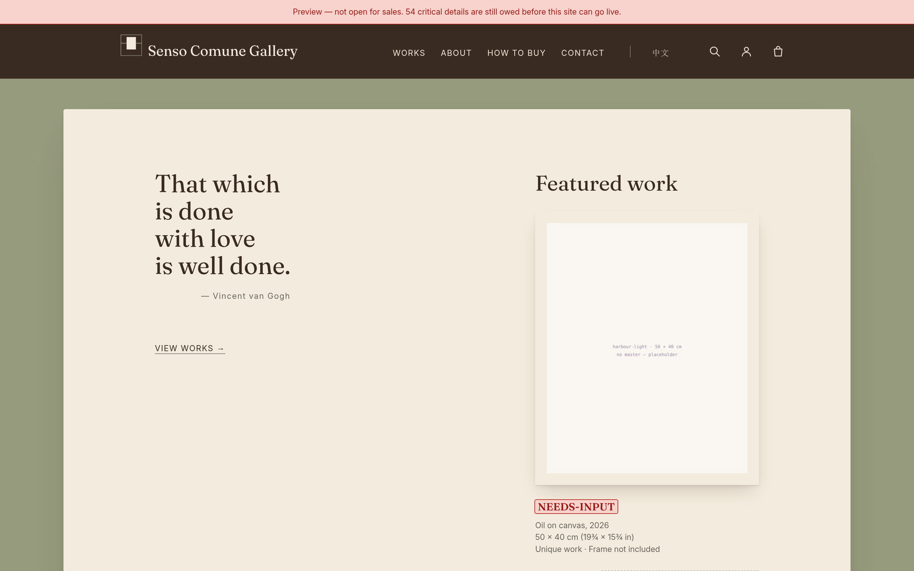
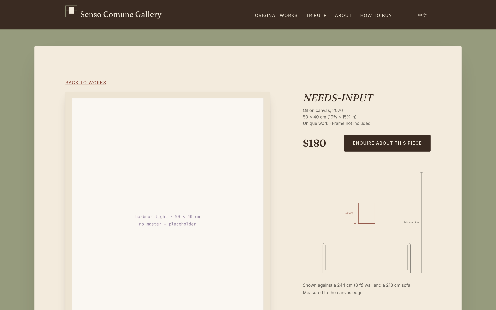
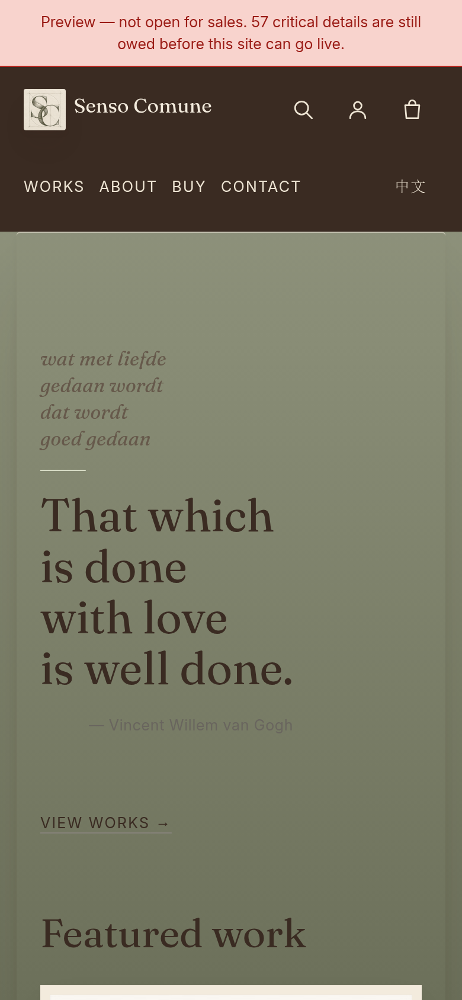

```{=latex}
\startbody
```

# Summary {#sec-summary}

## What this is

A site selling six unique paintings, priced \$60–\$440, run by one
non-technical person resident in mainland China, addressed equally to
international and domestic buyers.

That last sentence contains most of the difficulty. A gallery site for six
works is an afternoon's work. A gallery site for six works that takes money
across the Chinese border, ships physical objects internationally, satisfies
two consumer-law regimes at once and loads acceptably on both sides of the
Great Firewall is not.

**Reading it.** Part 1 is this summary and the decisions already taken.
Part 2 covers the design. Part 3 covers money — paying, shipping, duty, tax.
Part 4 covers law and accessibility. Part 5 is the build. Part 6 lists what is
still unresolved, which is the part to read before spending anything.

## The seven findings that would have sunk it {#sec-blockers}

: Blocking findings, in the order they must be dealt with {#tbl-blockers}

| Ref | Finding |
|:--|:------------------------------------------------|
| A-01 | Every call to action was `#A19E97` — **2.67:1**, failing both the body-text and the large-text floor. No font size rescues it. |
| B-01 | **Stripe**\index{Stripe} is unavailable to a mainland-China seller — the whole account, not merely PayPal. **Airwallex**\index{Airwallex} excludes mainland entities from card acquiring and opens no individual accounts at all. |
| B-03 | `vercel.app` and `workers.dev` measure **100% blocked** from mainland China. `pages.dev` measures 0%. |
| B-05 | A unique pre-existing painting gets **no returns exception** under either Chinese or EU law. Uniqueness is not personalisation. |
| B-06 | Instagram was the only contact channel. It is blocked in mainland China, and EU law requires an email address regardless. |
| B-08 | **China-origin paintings are not duty-free into the United States.** Section 301\index{Section 301} adds 7.5% and the \$800 de minimis\index{de minimis} exemption is suspended. |
| N-01 | A one-page site cannot link to one painting, which is the site's main acquisition motion. |

## Decisions taken {#sec-decisions}

```{=latex}
\begin{finding}{Settled}
```

**Launch as an individual**, with the Hong Kong entity\index{Hong Kong entity}
reachable as a configuration change rather than a rebuild. Under CNY 100,000
annual turnover there is no business-registration requirement, no
foreign-exchange quota consumed, no balance-of-payments filing and no VAT.

**Host on Cloudflare Pages**\index{Cloudflare Pages}. The only option with no
bill, no pause, no terms problem and no ICP filing\index{ICP filing}.

**Seven documents per language, not one.** The editorial scroll is kept;
`@view-transition` restores the single-page feel in two lines of CSS.

**Self-host the fonts.** 79.8 KB for both families, built from the variable
originals.

**Adopt Priscilla's sage palette**, with text moved onto cream.

```{=latex}
\end{finding}
```

## Cost {#sec-cost}

: Running cost of the recommended build {#tbl-cost}

| Item                              | One-off | Annual |
|:----------------------------------|--------:|-------:|
| Hosting (Cloudflare Pages)        |      \$0 |    \$0 |
| Domain (registrar at cost)        |       —  |   \$11 |
| Fonts, licensing (SIL OFL)        |      \$0 |    \$0 |
| Analytics                         |      \$0 |    \$0 |
| Photography, phone build          |  \$6–25  |     —  |
| Photography, full build           | \$360–400|     —  |
| Copyright registration, batch     |     \$85 |     —  |
| **Total, minimum viable**         | **\$6–25** | **\$11** |

Payment processing is separate and depends on the entity decision; see
@sec-paying.

# Design {#sec-design}

## Where the design came from

Priscilla supplied a nine-page draft and, later, a live mockup with a revised
palette. Both were treated as the brief. The work here was not to redesign but
to find where the drawing and the medium disagree — and they disagreed mostly
about contrast.

## The palette {#sec-palette}

Priscilla's mockup moves the site from white to a sage-green world: a dark
brown masthead bar, warm brown text, terracotta, and cream plates behind the
paintings. Two of her decisions were already right and are kept exactly as
drawn — the warm browns, and a **filled** terracotta button.

{#fig-palette width=100%}

### What could not be adopted as drawn {#sec-sage}

Body text on the sage does not pass, and the accent on sage is worse than the
value it was replacing.

{#fig-sage width=100%}

```{=latex}
\begin{finding}{The resolution was already in her own mockup}
```

She sets the paintings on light cream plates against the sage. So sage becomes
the **field** and cream the **reading surface** — the whole content column is a
cream sheet mounted on sage, which is what a gallery does to a work on paper
anyway.

Her green stays dominant at the margins, the reading happens on cream, and
nothing sets text on sage.

```{=latex}
\end{finding}
```

### The warm-ground trap {#sec-trap}

`#767676` is the canonical "lightest grey that passes on white". On pure white
it passes at 4.54:1, with 0.04 to spare. Warm the ground at all and it fails.

This caught the project three times — twice in tokens written specifically to
avoid it. The response was to stop checking by eye: `scripts/check-contrast.mjs`
recomputes every token against **the darkest ground it is ever painted on** and
fails the build on a regression.

## Typography {#sec-type}

Two open-source variable faces, self-hosted: Fraunces\index{Fraunces} and Inter.

: Font build, measured rather than estimated {#tbl-fonts}

| Build                                                   |   Bytes |
|:--------------------------------------------------------|--------:|
| Fraunces, all four axes                                  | 121,124 |
| **Fraunces, `opsz` 14–40, `wght` 400–700, `WONK` 1**     | **51,868** |
| Fraunces, `opsz` pinned                                  |  32,500 |
| **Inter, `opsz` 18, `wght` 400–600**                     | **29,856** |
| **Total, both families, latin subset**                   | **81,724** |

Two corrections came out of running the build rather than reading about it.
The draft sets Fraunces at six optical sizes — 16.0, 16.8, 21.6, 27.2, 30.4 and
38.4 — so the `opsz` axis must stay live; pinning it saves 19 KB and flattens
the optical sizing the design depends on. And Fraunces' `WONK` axis defaults to
**1, not 0**; pinning it to 0 changes the letterforms to save 140 bytes.

### The scale {#sec-scale}

Not the golden ratio. The one proportional system in Leonardo's own hand, on
the *Vitruvian Man* sheet, is whole-number fractions of height.

: Type scale, and how close Priscilla's draft already was {#tbl-scale}

| Role             | Fraction         | Computed | Draft used |
|:-----------------|:-----------------|---------:|-----------:|
| Hero             | 1 (the height)   |  38.4 px |    38.4 px |
| Section heading  | less 1/8         |  33.6 px |    30.4 px |
| Sub-heading      | less 1/4         |  28.8 px |    27.2 px |
| Wordmark         | 1/6 + 1/4        |  22.4 px |    21.6 px |
| Body             | the unit         |  16.8 px |    16.8 px |
| Caption          | less 1/4         |  12.6 px |    13.1 px |

## The two masters {#sec-masters}

The brief asked for a debt to Leonardo and to van Gogh, carried without ever
announcing itself. The test applied throughout: *a visitor who knows nothing
should feel only that the site is calm and well made; a visitor who knows the
work should feel recognised.*

### What was adopted

- **The accent is sanguine**\index{sanguine}. Red chalk, the medium Leonardo
  drew in, measures 6.33:1 on white; the oxblood Priscilla chose by eye
  measures 6.68:1. They are the same colour. The recommendation was to change
  nothing and record why.
- **No hard edges.** Leonardo's instruction to paint *"without strokes or
  lines, in the manner of smoke"*\index{sfumato} and the Chinese 没骨
  ("boneless") tradition of painting without contour are the same idea reached
  independently. For a Chinese painter addressing both audiences that is a
  structural principle, not a motif. Section boundaries dissolve rather than
  rule.
- **The rules are van Gogh's stated violet.** He told Theo the *Bedroom* walls
  were "of a pale violet"; they read blue today because the red lake faded. The
  site uses the colour he said, not the colour that survived.
- **Hatching runs his way.** Leonardo was left-handed, so his stroke runs
  upper-left to lower-right. No text source could be retrieved, so the 43.8°
  angle is an original structure-tensor measurement of his sheets, validated
  against a right-handed control.

### What was cut, and why {#sec-cut}

```{=latex}
\begin{openitem}{The myth filter}
```

**Golden-ratio grid.** Unsupported. Illustrating Pacioli's *De divina
proportione* establishes that Leonardo drew the solids, not that he composed on
the ratio.

**"Leonardo invented sfumato", and the word itself.** Cennino Cennini described
blending shadows like smoke a century earlier, and Leonardo never used the
noun — a full-text search of the *Trattato* returns none.

**Any yellow as text.** Indian yellow is 2.10:1 and zinc yellow 1.53:1. Both are
genuine *Starry Night* pigments and both are unusable for anything but a mark
inside an image.

**Sampling colours off the paintings.** The *Bedroom* wall as it survives today
is 2.78:1; the *Sunflowers* chrome yellow 2.70:1. Both sit within a hair of the
2.67:1 failure this report opens with.

```{=latex}
\end{openitem}
```

## The site as built {#sec-built}

Four views, at the two widths the layout was verified at. The screenshots are
of the built pages, not mockups: what is shown is what `npm run build`
produces.

{#fig-home width=100%}

{#fig-work width=100%}

{#fig-sold width=100%}

{#fig-mob width=42%}

# Money {#sec-money}

## Paying {#sec-paying}

### The constraint

```{=latex}
\begin{blocker}{B-01 \textperiodcentered{} Stripe is not available}
```

Mainland China is absent from Stripe's supported business countries. Hong Kong,
Singapore and Japan are present. This is not the narrower finding about
PayPal — it is the whole account.

Airwallex looked like the answer and is more restricted than it appears. A
mainland entity can open an account for Global Accounts, foreign exchange and
transfers, but card acquiring is excluded in Airwallex's own Chinese-language
terms, and it opens no personal accounts at all.

```{=latex}
\end{blocker}
```

{#fig-payments width=100%}

### Route A — launch as an individual {#sec-individual}

Chinese law is unusually accommodating at this scale.

: What the individual route does not require {#tbl-individual}

| Requirement | Position | Authority |
|:---|:---|:---|
| Business registration | **Not required** under CNY 100,000/yr online turnover | SAMR Order 37\index{SAMR Order 37}, Art. 8 ¶3 |
| FX annual quota | **Not consumed** — cross-border e-commerce settles outside it | 汇发〔2020〕14号 Art. 66(2) |
| BOP declaration | **Not filed** — resident individuals exempt at or below USD 10,000 per transaction | 汇发〔2022〕22号 Art. 8 |
| VAT | **Exempt** — monthly sales under CNY 100,000, to 31 Dec 2027 | 财政部/税务总局 2023年第19号 |

Six works at \$60–\$440 is roughly CNY 19,000 — an order of magnitude below the
registration ceiling.

```{=latex}
\begin{blocker}{What Priscilla must not do}
```

Route sale proceeds as a gift or family remittance; split transactions to stay
under a threshold; or use informal currency swaps. The last is 私自买卖外汇
under Article 45 of the FX Regulations, and published enforcement puts the
penalty on the offender's PBOC credit file.

```{=latex}
\end{blocker}
```

### Route B — a Hong Kong sole proprietorship {#sec-hk}

A Business Registration certificate is sufficient — no incorporation. That
unlocks the free Airwallex plan with no-code payment links, international cards
at 3.60% + HK\$2.35, **and Alipay**\index{Alipay} **and WeChat
Pay**\index{WeChat Pay} as merchant methods, which is how the domestic half of
the audience is served from one checkout.

It also unlocks repatriation: Airwallex supports local CNY transfer for sellers
without a mainland registered business whose ultimate beneficial owner is a
Chinese national exporting goods from the mainland. That describes this business
exactly.

```{=latex}
\begin{openitem}{Confirm before incorporating}
```

Airwallex approves its Payments product **separately** from account opening, and
reviews the live site as part of that review. The entity list verified covers
account opening only.

```{=latex}
\end{openitem}
```

### Rejected

**Payoneer Checkout** is Stripe-powered, excludes mainland China explicitly, and
requires monthly volumes above USD 20,000 — roughly 130× this business.
**PingPong** and **LianLian** both have real independent-site acquiring, but
neither publishes pricing or eligibility and both are sales-led. Do not design
around either without a written quote.

## Shipping {#sec-shipping}

{#fig-shipping width=100%}

```{=latex}
\begin{finding}{Works on paper ship flat, never rolled}
```

Rolling cracks the paper's sizing and can crease or smear the media. Tubes are a
fallback for very large **unstretched** canvas only.

Stretched canvas ships upright, never flat, with the bubble wrap outside the
rigid boards so nothing touches the paint. Cold is a real hazard: linseed oil
stiffens and can crack below freezing, which matters for winter shipping.

```{=latex}
\end{finding}
```

One reassurance worth stating plainly: the much-discussed "\$1,000 artwork cap"
does not bind here. FedEx caps declared value on art at \$1,000 or \$9.07/lb,
whichever is greater; USPS additional insurance for artwork caps around \$1,000.
Every one of those caps sits above this entire inventory.

## Duty and tax at the border {#sec-duty}

```{=latex}
\begin{blocker}{B-08 \textperiodcentered{} The site cannot say ``duty-free'' to US buyers}
```

Original paintings under HS 9701\index{HS heading 9701} carry a **Free** base
rate, which is where the belief comes from. For a **China-origin** shipment in
2026 it is wrong.

- **Section 301 List 4A applies.** HTSUS 9903.88.15 imposes **+7.5%** on
  products of China, and US note 20(s)(i) enumerates `9701.91.00` —
  contemporary paintings — among the covered subheadings. The exclusion that
  once covered paintings is expired.
- **De minimis is suspended.** The \$800 exemption no longer applies, so every
  painting needs a customs entry.
- **The IEEPA tariffs are gone** — struck down and revoked in February 2026 —
  and artworks were separately carved out of them as "informational materials".
  That relief does **not** extend to Section 301.

```{=latex}
\end{blocker}
```

{#fig-duty width=100%}

: Import treatment by destination {#tbl-import}

| Destination | Duty | VAT / tax | Confidence |
|:---|:---|:---|:---|
| United States | **+7.5%** Section 301 | — | Verified |
| United Kingdom | **0%**, ERGA OMNES (origin-neutral) | Reduced art rate | Verified |
| European Union | 0% expected | Reduced art rate per member state | **Unverified — see @sec-open** |

{#fig-buy width=100%}

## The donation pledge {#sec-donation}

The draft said "10% of each order goes toward research", which is a
per-transaction consumer promise. The site now says *"I personally donate 10% of
my profits each quarter"* — a personal pledge, which is a materially different
representation.

What protects the pledge is not the wording but the receipts: a public page with
the recipient named, the basis stated, the cadence disclosed, and a running
cumulative total.

# Law and access {#sec-law}

## Returns {#sec-returns}

```{=latex}
\begin{blocker}{B-05 \textperiodcentered{} Returns cannot be refused, in either market}
```

**China.** Consumer Protection Law Art. 25 gives a seven-day no-reason return on
distance sales. The exceptions are a **closed list** — SAIC Order 90 Art. 6
excludes only goods made to the consumer's order, perishables, unsealed digital
media and delivered periodicals. The 2024 Implementing Regulations Art. 19 then
expressly forbid a trader expanding that list, and ban pre-ticked exclusion.

**European Union.** CRD Art. 16(c) excepts goods "made to the consumer's
specifications or clearly personalised". **Uniqueness is not personalisation** —
the test is whether the *buyer* specified it. A pre-existing painting chosen
from a catalogue of six fails that test.

A "governed by PRC law" clause does not help: Rome I Art. 6(2) prevents a choice
of law from depriving a consumer of protections that cannot be derogated from
under their home law, where the trader directs activity there. Offering EU
shipping at checkout is directing activity.

```{=latex}
\end{blocker}
```

**One worldwide 14-day policy** over-satisfies the Chinese seven days, removes
any need to geo-detect buyers, and avoids a seven-day policy reading as an
attempt to shorten the EU right. Commissions are the one genuine exception under
both regimes.

## Disclosure {#sec-disclosure}

One block of address, phone and email satisfies three regimes at once: the EU
Consumer Rights Directive Art. 6(1)(c), the Chinese requirement, and the UK
anticipatory duty. Alongside it, SAMR Order 37 Art. 12 prescribes the exact
sentence an unregistered individual seller must publish:

> 个人从事零星小额交易活动，依法不需要办理市场主体登记

That string is quoted verbatim from the rule and must not be paraphrased.

## Privacy {#sec-privacy}

PIPL\index{PIPL} applies, and the burden is smaller than expected. Processing
necessary to conclude and perform the sale needs **no consent checkbox** — a
just-in-time notice at the email field is the correct pattern, and consent is
reserved for the newsletter. No PRC representative and no regulator filing are
required, because those provisions bind handlers *outside* China. The overseas
hosting is exempt from the CAC transfer mechanisms both as contract-necessary
and on volume.

## Accessibility {#sec-a11y}

### The legal position

Calmer than the compliance industry suggests. A one-person operation is almost
certainly exempt from the European Accessibility Act as a microenterprise
providing services. The stronger argument for the work is commercial:
**a blind collector who cannot read the descriptions cannot buy the painting.**

### What was built

: Accessibility work, by criterion {#tbl-a11y}

| Criterion | What it required | Status |
|:---|:---|:---|
| 1.4.3 Contrast\index{WCAG} | Every CTA was 2.67:1 | Filled ink control at 11.45:1 |
| 1.4.1 Use of colour | No accent reaches 3:1 against body text | Underlines on body links, structurally |
| 2.4.7 / 1.4.11 Focus | A single-colour ring dies over a dark painting | Two-tone ring, works on any ground |
| 2.4.11 Focus not obscured | Sticky nav can hide the focused item | `scroll-padding-top`; static on mobile |
| 2.5.8 Target size | Nav bars are not sentences; the inline exception does not apply | 48 px via padding |
| 1.1.1 Non-text content | Six paintings, no alt text | Three-layer description per work |
| 2.4.4 Link purpose | Six identical "Buy" links in the links list | Visually-hidden span per control |

### Describing a painting {#sec-alt}

The "125-character limit" is folklore — there is none in the HTML specification
or in WCAG. The citable number is Cooper Hewitt's **approximately fifteen
words**.

The guidance genuinely disagrees on interpretation: the DIAGRAM Center says
never interpret, Cooper Hewitt says interpret when it aids visual understanding.
For an artist's own gallery Cooper Hewitt is right — but interpretation stays
textually separable, labelled "Artist's note", placed last, and never allowed to
replace observation.

```{=latex}
\begin{openitem}{On AI-drafted descriptions}
```

Acceptable as a first pass, never as shipped text. A model can report palette,
format and apparent handling. It cannot know the true medium, the real
dimensions, the title, or the intent — which is exactly what a buyer needs. A
wrong description is worse than none, because it burns trust in the channel.

```{=latex}
\end{openitem}
```

# The build {#sec-build}

## Shape

Plain Node, no framework — which is what the evidence concluded and what the
design's own argument implies. Twenty-eight pages generated from three data
files.

```
src/data/       seller.json · artworks.json · site.json
src/styles/     tokens.css · base.css · gallery.css
src/templates.js
build.js        28 pages, two locales
scripts/        build-fonts · build-images · check-contrast · check-links
```

## The entity switch {#sec-switch}

One string in `seller.json` moves the whole site between the two commercial
routes:

```json
"activeEntity": "individual"   →   "hk-sole-prop"
```

That switches the published legal disclosure, the invoicing language, the
checkout provider and the returns basis together. No template knows which entity
is active.

## Overselling {#sec-oversell}

{#fig-oversell width=100%}

No platform in this price range guarantees atomicity. The client-side
availability check is roughly forty lines and is the only layer that survives a
stale CDN page, a silently failed rebuild or a bfcache restore.

Alongside it, a published policy costs nothing and settles the residual case:
*in the rare event two people buy the same piece at once, the first completed
payment stands and the second is refunded in full within 24 hours.*

## Checks that block the build {#sec-checks}

`check-contrast.mjs` recomputes every token against its worst-case ground.
`check-links.mjs` verifies dead links, missing `alt`, missing `width`/`height`,
heading order, landmark counts and hreflang reciprocity.

They have earned their place. Between them they caught a muted grey that passed
on white and failed on the darkest wash, work pages shipping with no `<h1>` at
all, and a mobile override that made the navigation invisible once the dark bar
was adopted.

```{=latex}
\begin{finding}{The limit of automation}
```

Automated testing decides roughly 13–30% of WCAG success criteria and catches
almost none of the focus-order and focus-visibility failures that block people
outright. The checks are a floor, not a pass.

```{=latex}
\end{finding}
```

# Open items {#sec-open}

Findings had to be implementable to reach this report. These are the places
where the evidence beneath a recommendation is thinner than the recommendation,
listed so nothing is built on them unchecked.

Five remain. Every one of them needs a person outside this project — a
customs broker, a tax adviser, a carrier, Airwallex — and none can be settled
by writing more code.

: Unresolved, in rough order of cost if wrong {#tbl-open}

| # | Item | Status | What to do |
|:--|:--|:--|:--|
| 1 | Cultural-relics export appraisal | **Not established.** Chinese government sources unreachable | Confirm a living artist's new work is not 文物 before the first export |
| 2 | EU reduced art VAT rates | **Unverified.** Directive (EU) 2022/542 changed art VAT from 2025 | Do not publish per-country rates yet |
| 3 | Carrier costs and insurance from China | No verified figures | Needed before the shipping page is final |
| 4 | Export declaration for a \$300 painting | Not established | Also determines what supports the bank's FX check |
| 5 | Airwallex + HK sole proprietorship | Entity list verified for account opening only | Ask before incorporating |

## Closed since the first draft {#sec-closed}

Three items that were open have been settled in the build itself.

: Closed, and where {#tbl-closed}

| Item | Resolution | Where |
|:--|:--|:--|
| CJK webfont strategy | The display face is subset to the ~100 characters that appear in headings, work titles and UI labels: **34 KB, from a 24 MB face.** `unicode-range` gates the fetch, so an English page never downloads it, and a character added before the next build falls through to the system face rather than rendering as tofu. Chinese body prose is deliberately not webfont-served. | `scripts/build-fonts-cjk.py` |
| Leonardo's hatching angle | Recorded in the stylesheet as a measurement rather than a citation, with the caveat that two chalk sheets ran the other way | `src/styles/base.css` |
| Mona Lisa glaze layer count | The thickness is cited; the count is not, and the comment says why | `src/styles/tokens.css` |

## Content still outstanding

The build reports every placeholder. The blocking ones are the six photographs,
the titles and descriptions, and the contact details — the email and phone are
not optional, they are the consumer-law requirement in @sec-disclosure.

# Appendix: sources and method {.unnumbered #sec-method}

**Colour.** Ratios computed with the WCAG 2 relative-luminance formula. The
draft's values were extracted from the PDF content stream rather than sampled
from a render, so they are declared values. Figures in this document read the
project's live token file.

**Fonts.** Built with fonttools 4.59.1 from the variable originals; byte counts
are measured output, not estimates.

**Reachability from mainland China.** Measured against a GFW measurement
service, with known-blocked controls validating the method before any result was
accepted.

**Regulatory material.** Chinese provisions read from `gov.cn` and
`safe.gov.cn`; EU instruments from the Publications Office; US tariff treatment
from the HTSUS and the Federal Register. Article numbers are given so each can
be checked.

**Layout.** Verified by headless screenshot at 1440 px and 390 px, not by
description. Three defects were found that way and are recorded in the commit
history.

```{=latex}
\cleardoublepage
\phantomsection
\renewcommand{\indexname}{Index}
\addcontentsline{toc}{part}{Index}
\printindex
```
